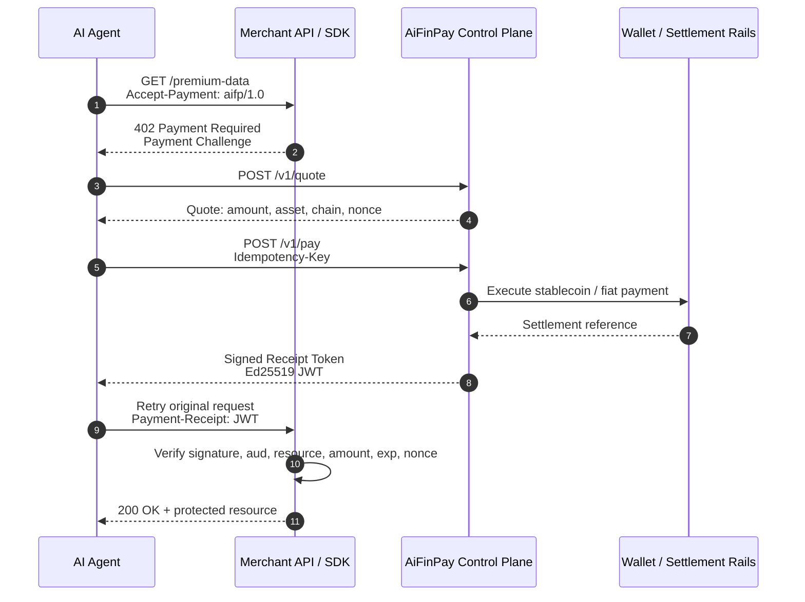
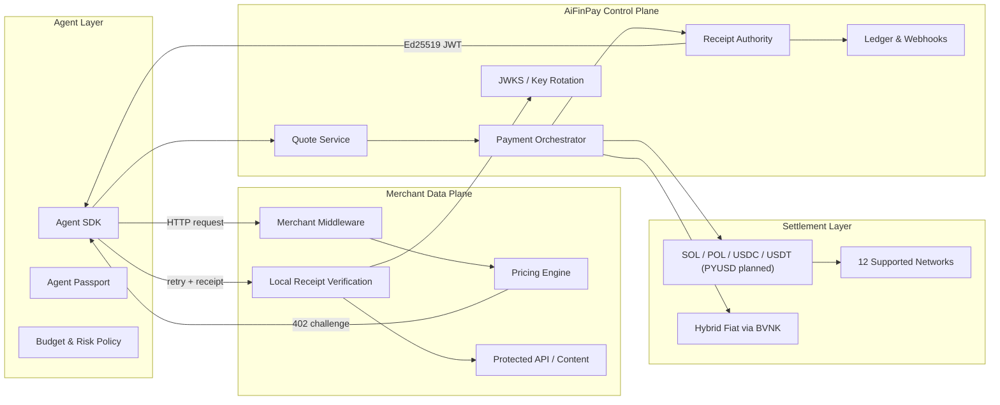
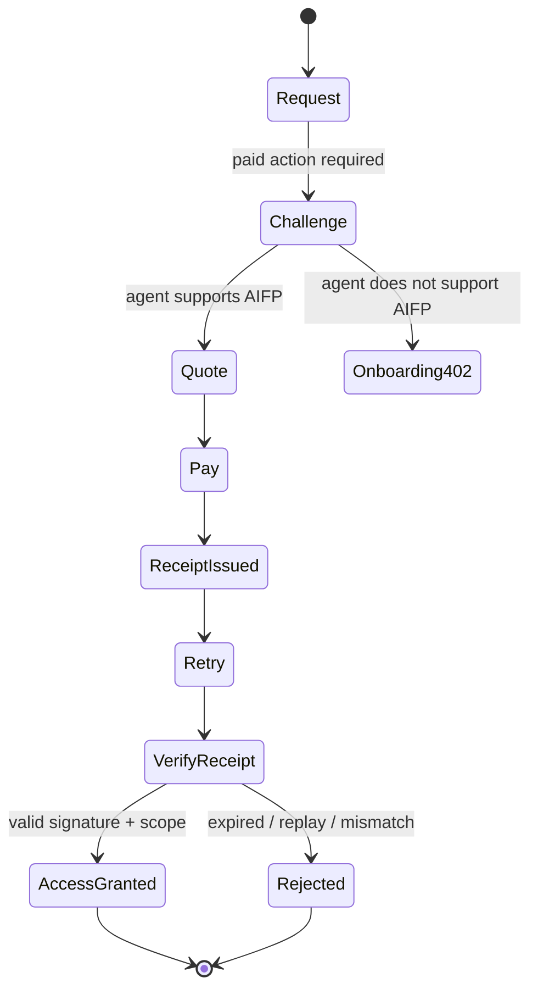
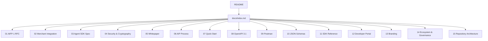

<p align="center">
</p>

<h1 align="center">AiFinPay Paywall Protocol</h1>

<p align="center">
  <strong>HTTP-native payments for AI agents, APIs, content, and machine-to-machine commerce.</strong>
</p>

<p align="center">
  AIFP is an open payment protocol that enables AI agents to natively pay for websites, APIs, data, compute, and digital services, while enabling providers to monetize AI traffic instead of blocking it. HTTP 402 compatibility is one of its interoperability features.
</p>

<p align="center">
  <a href="docs/index.md"></a>
  <a href="LICENSE"></a>
  <a href="docs/aifp/01-AIFP-1-RFC-Payment-Protocol-Specification.md"></a>
  <a href="docs/aifp/08-OpenAPI-3.1-Specification.yaml"></a>
  <a href="ROADMAP.md"></a>
</p>

---

## The Internet Needs Native Payments For Agents

AI agents increasingly fetch data, call APIs, read content, and execute workflows without a human in the loop. The human web monetization stack was not designed for this:

| Old Web Model | Why It Breaks For Agents | AIFP Replacement |
|---|---|---|
| Ads | Agents do not view or click ads | Per-action machine payments |
| Subscriptions | Agents cannot subscribe to every source they touch | Stateless receipts scoped to a resource |
| Manual API keys | Too slow for dynamic discovery | `402` challenge and automatic payment |
| Card checkout | Transaction fees exceed machine-action value | Micropayments with stablecoin and fiat settlement |
| Bot blocking | Negative-sum for providers and builders | Monetize machine traffic |

AIFP makes payment a native application-layer primitive for the AI web.

> **Canonical pricing update:** agent actions are priced as Standard, Complex, and Premium tiers starting at $0.00001. AiFinPay charges a 1% protocol fee on successful transactions; 99% settles to the merchant, excluding applicable network or settlement costs.

---

## Navigation

| Destination | What You Get |
|---|---|
| [Documentation Portal](docs/index.md) | Human-friendly docs entry point and navigation |
| [AIFP Documentation Set](docs/aifp/README.md) | RFCs, specs, guides, whitepaper, governance, SDK reference |
| [Protocol Architecture](docs/architecture.md) | System architecture, flows, trust boundaries, repository layout |
| [Quick Start](docs/quickstart.md) | Merchant, agent, wallet, and sandbox starts |
| [OpenAPI](docs/aifp/08-OpenAPI-3.1-Specification.yaml) | Machine-readable API contract |
| [JSON Schemas](schemas/README.md) | Schema package and validation strategy |
| [SDKs](sdk/README.md) | SDK architecture and language matrix |
| [Examples](examples/README.md) | Merchant, agent, wallet, and webhook examples |
| [Sandbox](sandbox/README.md) | Local and hosted sandbox guide |
| [Roadmap](ROADMAP.md) | Release plan toward public standardization |
| [Contributing](CONTRIBUTING.md) | How to propose changes safely |
| [Security](SECURITY.md) | Responsible disclosure and cryptographic expectations |

---

## How AiFinPay Works

AIFP activates the long-reserved HTTP `402 Payment Required` status code. A merchant returns a machine-readable payment challenge. The agent pays through AiFinPay, receives a signed receipt token, retries the original request, and the merchant verifies the receipt locally.



---

## Architecture Overview



AIFP separates the **control plane** from the **data plane**. The control plane issues quotes, executes payments, signs receipts, manages keys, and publishes webhooks. The merchant data plane verifies receipts locally by signature, so access remains fast and resilient even when the control plane is degraded.

---

## Protocol Primitives

| Primitive | Purpose | Source Of Truth |
|---|---|---|
| `402 Payment Required` | HTTP-native payment challenge | [AIFP-1](docs/aifp/01-AIFP-1-RFC-Payment-Protocol-Specification.md) |
| Payment Challenge | Tells the agent how much, where, and how to pay | [AIFP-1](docs/aifp/01-AIFP-1-RFC-Payment-Protocol-Specification.md) |
| Quote | Binding price for a specific resource | [OpenAPI](docs/aifp/08-OpenAPI-3.1-Specification.yaml) |
| Receipt Token | Ed25519 signed proof of payment | [Security Spec](docs/aifp/04-Security-and-Cryptography-Specification.md) |
| Agent Passport | Portable agent identity | [Agent SDK Spec](docs/aifp/03-AI-Agent-SDK-Specification.md) |
| JSON Schemas | Validation source for protocol objects | [JSON Schemas](docs/aifp/10-JSON-Schemas.md) |
| AIP Process | Governance for protocol evolution | [AIP Process](docs/aifp/06-AIP-Improvement-Proposal-Process.md) |

---

## HTTP 402 Flow



### Canonical Payment Challenge

```json
{
  "payment_challenge": {
    "version": "1.0",
    "scheme": "aifp",
    "quote_endpoint": "https://api.aifinpay.io/v1/quote",
    "merchant_id": "mrch_9f3a1c2b",
    "resource": "/api/data",
    "pricing_tier": "standard",
    "estimated_amount": "0.00001",
    "currency": "USD",
    "accepted_assets": ["SOL", "POL", "USDC", "USDT"],
    "accepted_chains": ["polygon", "base", "solana"],
    "nonce": "b7e2...c91a",
    "expires_at": "2026-06-28T12:34:56Z"
  }
}
```

### Receipt Verification Contract

Every receipt is verified locally by the merchant:

| Check | Required Behavior |
|---|---|
| Signature | Verify EdDSA / Ed25519 against current JWKS `kid` |
| Issuer | Must be trusted AiFinPay receipt authority |
| Audience | Must match merchant id |
| Resource | Must match the retried resource |
| Amount | Must meet or exceed required action price |
| Expiry | Default TTL is 600 seconds |
| Nonce | Must be single-use, replay rejected with `409` |

---

## Pricing Model

| Agent Action Tier | Starts From | Typical Action |
|---|---:|---|
| `standard` | `$0.00001` | Simple read, single record, lightweight API request |
| `complex` | `$0.00006` | Search, aggregation, multi-source queries, higher compute |
| `premium` | `$0.00010` | AI inference, GPU workloads, deep analytics, premium data |

### Pricing Rules

| Rule | Value |
|---|---|
| Protocol fee | AiFinPay charges **1%** of every successful transaction |
| Merchant settlement | The remaining **99%** is settled to the merchant |
| Batch settlement | Unit prices are per-request **metering values** — agents prepay a batch (e.g. `$0.10` ≈ 10,000 standard requests) in **one** on-chain transaction and spend it down per request via a multi-use quota receipt. See AIFP-1 §19.4 |
| Settlement costs | Payment network, gas, processor, or settlement costs may apply separately |
| Idempotency | `Idempotency-Key`, 24 hour dedupe window |
| x402 migration | 1,000 free migration requests |
| Assets | SOL, POL, USDC, USDT (PYUSD planned) |
| Networks | Solana, Polygon, Avalanche, BNB Chain, Optimism, Arbitrum, Base, Unichain, BOT Chain, XRPL EVM, NEAR, Aptos |
| Native token | None |

---

## Developer Experience

### Merchant Quick Start

> `@aifinpay/merchant` is planned — for now verify receipts with a standard JWT library (e.g. `jose`), see snippet below.

```bash
npm install @aifinpay/merchant
```

```ts
import { aifpPaywall } from "@aifinpay/merchant";

app.use(aifpPaywall({
  merchantId: "mrch_...",
  pricing: {
    "/api/data": { tier: "standard" }
  }
}));
```

### Agent Quick Start

```bash
npm install @aifinpay/agent
```

```ts
import { AIFPAgent } from "@aifinpay/agent";

const agent = new AIFPAgent({
  apiKey: process.env.AIFP_AGENT_KEY,
  walletId: "wlt_...",
  budget: { dailyUsd: 5 }
});

const response = await agent.fetch("https://merchant.example.com/api/data");
```

### API Quick Start

```bash
curl https://api.aifinpay.io/v1/quote \
  -H "Authorization: Bearer $AIFP_AGENT_KEY" \
  -H "Content-Type: application/json" \
  -d '{"merchant_id":"mrch_9f3a1c2b","resource":"/api/data","pricing_tier":"standard"}'
```

---

## Repository Structure

```text
aifinpay-paywall/
├── README.md                         # premium project entrypoint
├── ROADMAP.md                        # protocol and repository roadmap
├── CHANGELOG.md                      # release history
├── CONTRIBUTING.md                   # contribution and AIP process
├── CODE_OF_CONDUCT.md                # community standards
├── SECURITY.md                       # responsible disclosure
├── SUPPORT.md                        # support paths
├── LICENSE                           # repository licensing
├── .github/                          # issue forms, PR template, workflows
├── docs/                             # documentation portal structure
│   ├── index.md
│   ├── navigation.md
│   ├── architecture.md
│   ├── quickstart.md
│   └── aifp/                         # canonical documentation set
├── sdk/                              # SDK design, references, examples
├── examples/                         # merchant, agent, wallet, webhook examples
├── sandbox/                          # sandbox guide and mock flows
├── schemas/                          # schema packaging and validation strategy
├── assets/                           # brand assets and diagrams
├── scripts/                          # docs and validation automation
└── tests/                            # protocol, docs, schema validation plan
```

---

## Documentation Map



---

## Roadmap

The repository roadmap focuses on public-release quality:

1. Canonical docs synced into `docs/aifp/`.
2. OpenAPI and JSON schema validation in CI.
3. Conformance test vectors.
4. Reference merchant and agent SDK examples.
5. Developer portal generation.
6. Public AIP governance and a public changelog.

See [ROADMAP.md](ROADMAP.md) for the full plan.

---

## Contributing

Protocol changes go through the AIFP Improvement Proposal process. Documentation fixes, examples, SDK implementation work, and schema clarifications can be proposed through pull requests.

Start with [CONTRIBUTING.md](CONTRIBUTING.md), then read the [AIP Process](docs/aifp/06-AIP-Improvement-Proposal-Process.md).

---

## Security

AiFinPay is a payment protocol. Security reports should not be filed as public issues. See [SECURITY.md](SECURITY.md) for responsible disclosure, scope, and expected handling.

---

## License

Code, examples, schemas, workflows, and automation are licensed under Apache-2.0. Documentation is licensed under CC BY 4.0 unless stated otherwise. See [LICENSE](LICENSE).

---

## Future Vision

AIFP is designed to become a foundational open protocol for the AI web: a neutral payment layer where agents can discover priced resources, reason about budgets, pay safely, and access the machine-readable economy without subscriptions or human checkout.
