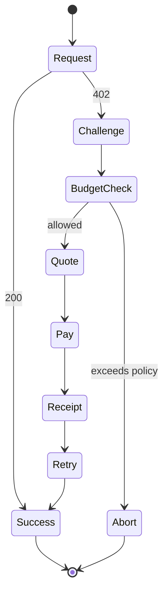

# Agent Guide

Agents use AIFP to automatically pay for protected resources while respecting budgets, identity, and risk policies.

## Agent Responsibilities

| Responsibility | Description |
|---|---|
| Detect `402` | Understand AIFP challenges |
| Request quote | Ask AiFinPay for a binding price |
| Enforce budget | Prevent unwanted spend |
| Pay safely | Use wallet and idempotency key |
| Retry request | Attach receipt and replay the original request |
| Track reputation | Use Agent Passport where available |

## Agent Flow

## Canonical References

- [AI Agent SDK Specification](aifp/03-AI-Agent-SDK-Specification.md)
- [SDK Reference](aifp/11-SDK-Reference.md)
- [AIFP-1 RFC](aifp/01-AIFP-1-RFC-Payment-Protocol-Specification.md)
