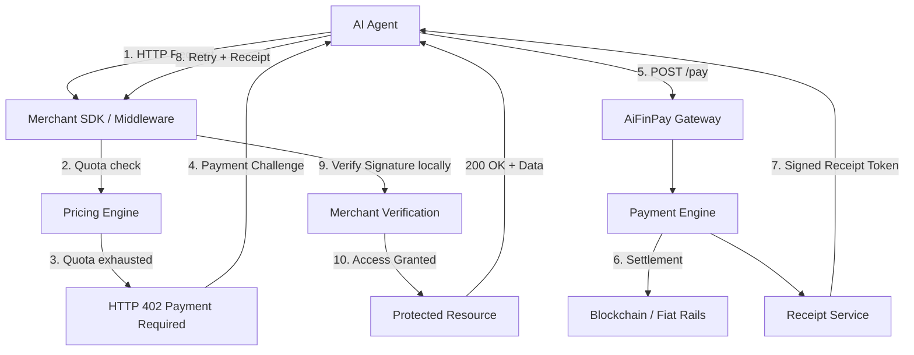
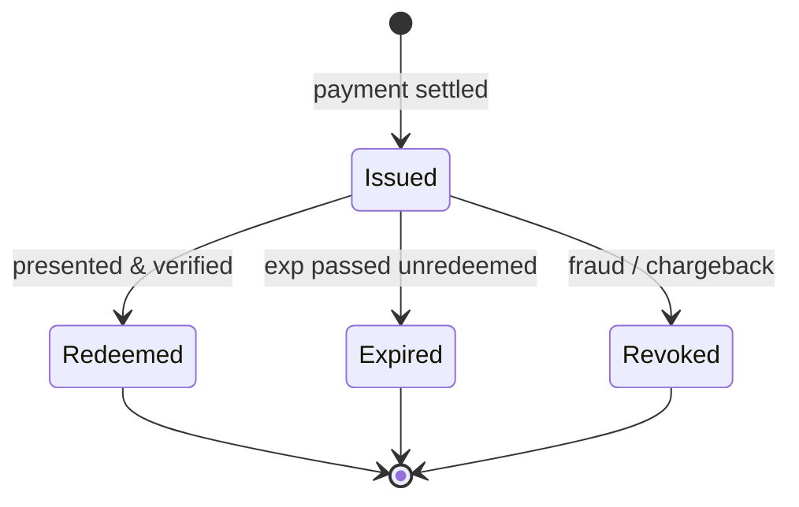
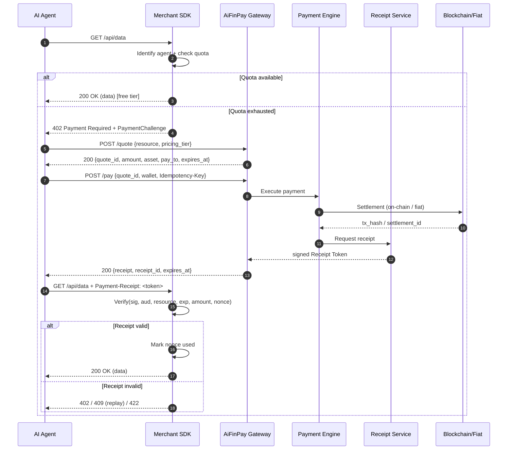
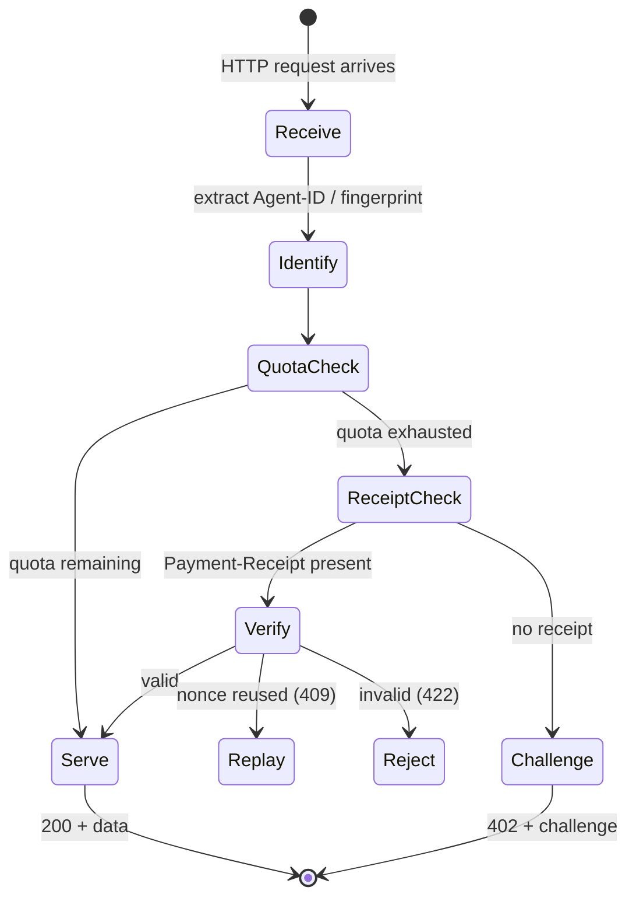
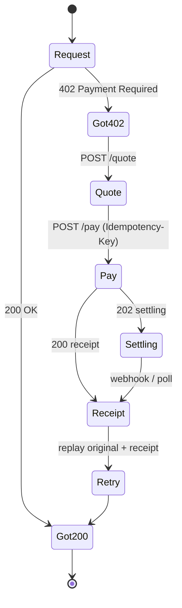
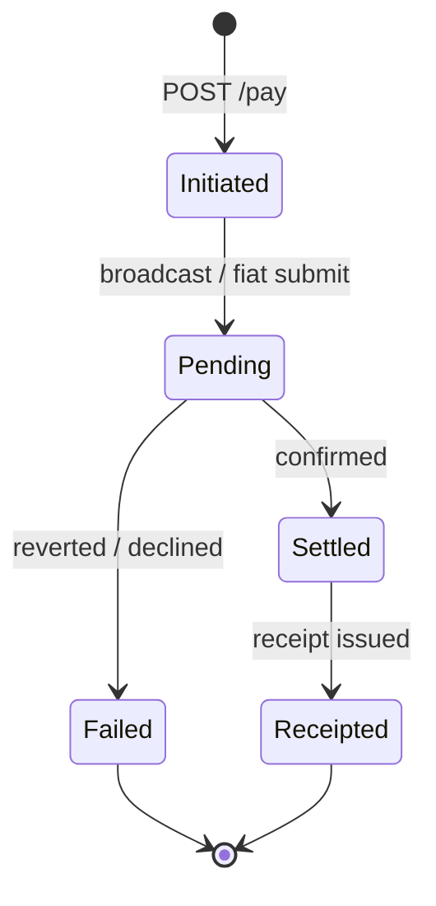

# AIFP-1 — AiFinPay Payment Protocol Specification

**Document:** AIFP-1
**Title:** AiFinPay Payment Protocol Specification
**Category:** Standards Track
**Status:** Draft Standard
**Version:** 1.0.0
**Date:** June 28, 2026
**Authors:** AiFinPay Protocol Team
**Contact:** protocol@aifinpay.io · https://aifinpay.io
**Document grade:** IETF RFC / EIP / Stripe API Reference / OpenAPI 3.1

> This is **Document 1 of 4** in the official AiFinPay documentation set:
>
> 1. **AIFP-1 — Payment Protocol Specification** *(this document — the normative standard)*
> 2. [Merchant Integration Guide](./02-Merchant-Integration-Guide.md) — server-side integration for 15 frameworks
> 3. [AI Agent SDK Specification](./03-AI-Agent-SDK-Specification.md) — client-side agent SDK across 7 languages
> 4. [Security & Cryptography Specification](./04-Security-and-Cryptography-Specification.md) — threat model & crypto
>
> This document is **self-contained**. It defines the protocol normatively. The other three documents are *implementation guidance* that conform to this specification. Where this document and another disagree, **this document governs**.

---

## Status of This Memo

This document specifies the AiFinPay Payment Protocol, version 1 (**AIFP-1**), an application-layer payment protocol layered on top of HTTP. It is published for the AiFinPay developer community, protocol implementers, enterprises, standards bodies, and investors. Distribution is unlimited.

AIFP-1 is a **Draft Standard**. It is stable enough for production implementation and is in active use, but normative details MAY be refined through the Open Governance process (Section 22) prior to promotion to **Internet Standard**. Implementers SHOULD track the protocol changelog (Appendix D) and the `AIFP-Version` negotiation mechanism (Section 8.3).

This memo does not represent the position of any standards-development organization. It is an open specification; implementations MAY compete.

---

## Copyright Notice

Copyright © 2026 AiFinPay, Inc. and the persons identified as authors. All rights reserved.

This document is licensed under **CC BY 4.0**. Reference implementations referenced herein are licensed separately (Apache-2.0 / MIT). The "AiFinPay" name and logo are trademarks of AiFinPay, Inc. The protocol itself is open; you may implement it without permission.

---

## Abstract

The web is entering an **AI-first** phase in which the primary consumer of content and APIs is no longer a human browser but an autonomous software agent. The two monetization models that built the human web — advertising and subscriptions — both fail for machine consumers: agents do not view ads, cannot complete human registration or KYC, and cannot subscribe to the thousands of resources a single task touches. Traditional payment rails (cards, ACH, SEPA) carry a minimum economically viable transaction of roughly **$0.30–$0.50** due to fixed fees, while a typical API request is worth **USD 0.00001–USD 0.00010** — a gap of three to four orders of magnitude.

**AIFP-1** inverts the prevailing "block the bots" posture into "monetize the machines." It defines a complete, HTTP-native payment handshake built on the long-reserved **`402 Payment Required`** status code: a merchant returns a machine-readable **Payment Challenge**, the agent pays through AiFinPay, receives a cryptographically signed **Receipt Token**, replays its original request with the receipt attached, and the merchant grants access after **stateless local signature verification** — no backend round-trip, no human in the loop.

This specification defines the protocol's message formats, HTTP semantics, authentication and authorization, the merchant/agent/wallet flows, x402 compatibility and migration, onboarding, error taxonomy, retry strategy, security and threat model, replay protection, cryptography, receipt verification, idempotency, settlement, multi-chain support (12 networks), fiat support, and the normative requirements an implementation MUST satisfy to claim conformance.

---

## Requirements Notation

The key words **MUST**, **MUST NOT**, **REQUIRED**, **SHALL**, **SHALL NOT**, **SHOULD**, **SHOULD NOT**, **RECOMMENDED**, **MAY**, and **OPTIONAL** in this document are to be interpreted as described in [RFC 2119](https://www.rfc-editor.org/rfc/rfc2119) and [RFC 8174] when, and only when, they appear in all capitals, as shown here.

---

## Table of Contents

1. [Vision](#1-vision)
2. [Design Goals](#2-design-goals)
3. [Terminology](#3-terminology)
4. [Protocol Overview](#4-protocol-overview)
5. [HTTP 402 Semantics](#5-http-402-semantics)
6. [Payment Challenge](#6-payment-challenge)
7. [Receipt Token](#7-receipt-token)
8. [HTTP Specification — Headers, Versioning, Idempotency](#8-http-specification--headers-versioning-idempotency)
9. [Complete Protocol Flow](#9-complete-protocol-flow)
10. [Authentication & Authorization](#10-authentication--authorization)
11. [Merchant Flow](#11-merchant-flow)
12. [Agent Flow](#12-agent-flow)
13. [Wallet Flow](#13-wallet-flow)
14. [x402 Compatibility & Migration](#14-x402-compatibility--migration)
15. [Onboarding Flow](#15-onboarding-flow)
16. [Message Formats](#16-message-formats)
17. [Error Codes & Retry Strategy](#17-error-codes--retry-strategy)
18. [Security Model & Threat Model](#18-security-model--threat-model)
19. [Settlement, Multi-chain & Fiat](#19-settlement-multi-chain--fiat)
20. [State Machines](#20-state-machines)
21. [OpenAPI & API Examples](#21-openapi--api-examples)
22. [Open Governance & Versioning](#22-open-governance--versioning)
23. [Normative Requirements Summary](#23-normative-requirements-summary)
24. [Future Extensions](#24-future-extensions)
- [Appendix A. Glossary](#appendix-a-glossary)
- [Appendix B. Supported Networks](#appendix-b-supported-networks)
- [Appendix C. Complete Error Registry](#appendix-c-complete-error-registry)
- [Appendix D. Changelog](#appendix-d-changelog)
- [Appendix E. References](#appendix-e-references)

---

# 1. Vision

## 1.1. Why the protocol exists

For the first time in the history of the web, the primary consumer of an HTTP resource is increasingly **not a human**. LLM agents, retrieval-augmented-generation (RAG) pipelines, training-data crawlers, and autonomous task executors now generate a large and growing share of API and content traffic.

The human web monetizes through two models, both of which break under machine consumption:

1. **Advertising.** An agent does not watch ads, does not click banners, and does not convert into a buyer. The model produces **zero revenue** from machine traffic.
2. **Subscriptions.** An agent cannot register, has no inbox to confirm, does not pass individual KYC, and cannot economically subscribe to each of the thousands of resources a single task run touches.

Lacking a payment mechanism, providers default to **defense**: blocking via `robots.txt`, WAF fingerprinting, IP rate-limiting, and CAPTCHAs. This is a **negative-sum** outcome — the provider loses revenue, the agent loses access, and infrastructure burns resources fighting traffic it could have monetized.

## 1.2. The market gap

| Problem | Current "solution" | Consequence |
|---|---|---|
| Agents consume APIs without paying | Block by User-Agent / IP | Lost revenue, arms race |
| Crawlers download training data | `robots.txt`, legal letters | Data still taken, no revenue |
| No way to charge a machine a micropayment | Subscriptions, manual API keys | Does not scale to millions of agents |
| Payment rails are built for humans | Card checkout | Minimum fee exceeds the value of a request |
| Agents have no identity | — | Payment cannot be attributed |

## 1.3. The AIFP solution

AIFP **monetizes** machine traffic instead of blocking it. Baseline scenario:

1. The merchant installs the AiFinPay middleware (a single line).
2. The merchant configures pricing: the first **100 requests free** (configurable), then **USD 0.00001–USD 0.00010** per request by pricing_tier.
3. On quota exhaustion, the server returns **`402 Payment Required`** with a machine-readable Payment Challenge.
4. The agent **automatically** pays through AiFinPay.
5. The merchant receives funds (on-chain or fiat/stablecoin settlement).
6. The agent receives a signed **Receipt Token**.
7. The agent **replays** its original request with the receipt attached.
8. The merchant **verifies the receipt locally** by signature — no round-trip.
9. **Access is granted.**

No registration, no subscriptions, no human in the loop — completed in a single `challenge → pay → retry` cycle.

## 1.4. The machine economy

AIFP lays rails for a **Machine-to-Machine (M2M) economy** in which agents own wallets and budgets, execute millions of micro-transactions, carry **identity and reputation** (Agent Passport), and use **delegated** and **streaming** payments. AIFP is to payments what TLS became to security and OAuth to authorization: it makes **payment a native part of HTTP semantics** for the machine web, finally activating the `402 Payment Required` status code that HTTP/1.1 reserved for exactly this purpose.

---

# 2. Design Goals

An AIFP-1 implementation is designed against eight principles. These are normative design constraints; conformance requirements derived from them appear in Section 23.

1. **Zero friction for machines.** Payment MUST complete without human involvement once an agent is funded.
2. **Stateless verification.** A merchant MUST be able to verify a receipt locally by signature, without contacting the AiFinPay backend.
3. **HTTP-native.** The protocol MUST rely on standard HTTP semantics — `402`, standard headers, idempotency.
4. **x402 compatibility.** Where appropriate, AIFP SHOULD interoperate with the x402 ecosystem.
5. **Multi-chain and fiat-agnostic.** Settlement MAY occur in stablecoins across 12 supported networks or in fiat.
6. **Secure by default.** Replay, double-spend, and MITM protections MUST be built in, not optional add-ons.
7. **Enterprise scale.** The architecture MUST sustain millions of requests per second and billions of receipts per day.
8. **Open protocol.** The specification SHOULD remain open; implementations MAY compete.

---

# 3. Terminology

> The full glossary is in **Appendix A**. The terms below are sufficient to read this document standalone.

- **Agent.** An autonomous software client (LLM agent, crawler, pipeline) that consumes resources and pays for them.
- **Merchant.** A provider of a paid resource (API or content) that integrates AIFP to monetize machine traffic.
- **Wallet.** A funding source bound to an agent: an on-chain wallet (custodial, non-custodial, or MPC) or a fiat balance.
- **Quote.** A server-issued, time-bounded price for accessing a specific resource at a specific pricing_tier.
- **Payment Challenge.** The machine-readable `402` payload telling an agent how and how much to pay.
- **Receipt Token.** A signed, time-bounded cryptographic proof of payment that grants access on retry.
- **Nonce.** A single-use value embedded in a challenge and receipt to prevent replay.
- **Free Quota.** The number of requests a merchant serves free before charging (default 100).
- **Pricing Tier Tier.** A merchant-assigned cost class for a resource: *standard / standard / complex / premium*.
- **Settlement.** The act of moving value to the merchant on-chain or via fiat rails.
- **Stateless Verification.** Local receipt validation by signature, exp, nonce, and amount, with no backend call.
- **Control Plane / Data Plane.** AiFinPay backend (quoting, payment, receipts) vs. merchant middleware (interception, verification).

---

# 4. Protocol Overview

## 4.1. Architectural model

AIFP separates a strongly consistent **Control Plane** (the AiFinPay backend: quoting, payment execution, receipt issuance, ledger, webhooks) from a replicated, low-latency **Data Plane** (the merchant middleware: request interception, quota checks, stateless receipt verification). This separation is the foundation of AIFP's scalability: **receipts are verified on the merchant side by signature**, so the backend is never in the per-request hot path.



## 4.2. Why stateless verification matters

Ed25519 signature verification runs at roughly **50,000 verifications per second per CPU core**. By verifying receipts locally, a merchant can authorize millions of paid requests per second with no dependence on AiFinPay availability. The backend's job ends the moment a receipt is signed; everything after is merchant-local. This is the single most important architectural decision in AIFP-1.

## 4.3. Degraded mode

Because verification is local, a merchant MUST continue to honor valid, unexpired receipts **even when the AiFinPay Control Plane is unreachable**. The Data Plane is eventually consistent and MUST keep working in degraded mode. New payments may be unavailable during a Control Plane outage, but already-issued receipts remain valid until expiry.

---

# 5. HTTP 402 Semantics

## 5.1. Activating a reserved status code

HTTP/1.1 ([RFC 9110]) reserves **`402 Payment Required`** "for future use." AIFP-1 defines that use. A merchant MUST return `402` when, and only when, access to a resource requires payment that has not yet been provided — specifically, when an identified agent's free quota is exhausted and no valid receipt accompanies the request.

## 5.2. Normative rules for 402

- A `402` response MUST carry a machine-readable Payment Challenge (Section 6), in a header, a body, or both.
- A `402` response MUST be **idempotent and side-effect free**: issuing a challenge MUST NOT consume quota or charge the agent.
- A `402` response MUST include a `nonce` and an `expires_at` so the challenge cannot be replayed indefinitely.
- A merchant MUST NOT return `402` for requests that carry a **valid, unexpired, correctly scoped** receipt; such requests MUST be served (or fail for an unrelated reason).
- A bare `402` with no challenge is **non-conformant**. When an agent does not advertise AIFP support, the merchant MUST return the onboarding form of `402` (Section 15).

## 5.3. Distinction from neighboring codes

| Code | Meaning in AIFP | Not to be confused with |
|---|---|---|
| `401` | Missing/invalid API credentials | `402` is about *payment*, not *identity* |
| `402` | Payment required to proceed | The protocol core |
| `403` | Agent blocklisted / merchant KYC fail | A *policy* denial, not a price |
| `409` | Receipt replay / idempotency conflict | A *uniqueness* failure |
| `425` | Payment not yet settled on-chain | Retry after `Retry-After`, same receipt |

---

# 6. Payment Challenge

## 6.1. Purpose

The Payment Challenge is the machine-readable instruction set an agent needs to pay: *where* to get a quote, *what* resource, *which* pricing_tier tier, *how much* (estimate), *which* assets and chains are accepted, a single-use **nonce**, and an **expiry**.

## 6.2. Variant A — header form (x402-compatible)

```http
HTTP/1.1 402 Payment Required
WWW-Authenticate: AIFP realm="api.example.com", quote="https://api.aifinpay.io/v1/quote", endpoint="/api/data", pricing_tier="standard"
AIFP-Payment-Required: true
Accept-Payment: aifp/1.0
Content-Type: application/json
```

## 6.3. Variant B — body form (canonical)

```json
{
  "error": {
    "type": "payment_required",
    "code": "AIFP-402",
    "message": "Free quota exhausted. Payment required to continue."
  },
  "payment_challenge": {
    "version": "1.0",
    "scheme": "aifp",
    "quote_endpoint": "https://api.aifinpay.io/v1/quote",
    "merchant_id": "mrch_9f3a1c2b",
    "resource": "/api/data",
    "pricing_tier": "standard",
    "estimated_amount": "0.04",
    "currency": "USD",
    "accepted_assets": ["USDC", "USDT", "PYUSD"],
    "accepted_chains": ["polygon", "base", "solana", "unichain"],
    "nonce": "b7e2...c91a",
    "expires_at": "2026-06-28T12:34:56Z"
  }
}
```

## 6.4. Field requirements

| Field | Req. | Notes |
|---|---|---|
| `version` | MUST | Protocol version, e.g. `"1.0"` |
| `scheme` | MUST | Always `"aifp"` for this protocol |
| `quote_endpoint` | MUST | Where the agent requests a binding quote |
| `merchant_id` | MUST | Stable merchant identifier `mrch_*` |
| `resource` | MUST | The protected path/resource |
| `pricing_tier` | MUST | `standard` \| `standard` \| `complex` \| `premium` |
| `estimated_amount` | SHOULD | Decimal string, USD-denominated estimate |
| `currency` | SHOULD | ISO-4217, default `"USD"` |
| `accepted_assets` | SHOULD | Stablecoins accepted, e.g. `USDC`, `USDT`, `PYUSD` |
| `accepted_chains` | SHOULD | Networks accepted (Appendix B) |
| `nonce` | MUST | Single-use, ≥128 bits entropy |
| `expires_at` | MUST | RFC 3339 timestamp |

## 6.5. Pricing tiers (canonical)

| Pricing Tier | Price (USD) | Typical use |
|---|---|---|
| `standard` | **USD 0.00001** | Cheap reads, key-value lookups |
| `standard` | **USD 0.00001** | Typical API call, single record |
| `complex` | **USD 0.00006** | Aggregations, search, multi-record |
| `premium` | **USD 0.00010** | Inference, heavy compute, premium data |

Free quota default: **100 requests** per agent before charging begins. Both pricing and quota are merchant-configurable; the values above are the protocol defaults and MUST be used when unset.

---

# 7. Receipt Token

## 7.1. Definition

A **Receipt Token** is a signed, time-bounded, audience-bound cryptographic proof that a specific agent paid a specific merchant for a specific resource. It is the credential that turns a `402` into a `200` on retry. Receipts are **bearer-restricted**: bound to an audience and a nonce so they cannot be replayed or reused across resources.

## 7.2. Encoding

A Receipt Token is a **JWS-signed JWT** (compact serialization) using **EdDSA / Ed25519**. A compact **CBOR-COSE** variant is defined for constrained environments (Section 16.4). Both carry identical claims.

## 7.3. Claims

```json
{
  "iss": "https://api.aifinpay.io",
  "sub": "agt_4f9a2c7e",
  "aud": "mrch_9f3a1c2b",
  "resource": "/api/data",
  "pricing_tier": "standard",
  "amount": "0.04",
  "currency": "USD",
  "asset": "USDC",
  "chain": "polygon",
  "tx_ref": "0xabc123...",
  "receipt_id": "rcpt_7b3e9f21",
  "nonce": "b7e2...c91a",
  "iat": 1782638400,
  "exp": 1782639000,
  "kid": "aifp-2026-06"
}
```

| Claim | Meaning |
|---|---|
| `iss` | Issuer — always the AiFinPay receipt authority |
| `sub` | The paying agent (`agt_*`) |
| `aud` | The merchant the receipt is valid for (`mrch_*`) — verification MUST reject a mismatch |
| `resource` | Resource paid for — MUST match the retried request |
| `amount` / `currency` / `asset` / `chain` | Settlement details |
| `tx_ref` | On-chain tx hash or fiat settlement reference |
| `receipt_id` | Unique receipt identifier |
| `nonce` | Single-use anti-replay value |
| `iat` / `exp` | Issued-at / expiry (default TTL **600 s**) |
| `kid` | Key ID for signature verification & rotation |

## 7.4. Stateless verification algorithm

A merchant MUST verify a receipt locally, with no network call, as follows:

```
1. Parse the JWT and read `kid`.
2. Resolve the issuer public key for `kid` (from a cached JWKS).
3. Verify the EdDSA signature. On failure → 422.
4. Check `iss` is the trusted AiFinPay issuer. On failure → 422.
5. Check `aud == this merchant_id`. On failure → 403.
6. Check `resource == requested resource`. On failure → 422.
7. Check `now < exp` (with ≤30s clock skew). On failure → 402 (expired).
8. Check `amount >= required price` for the resource/pricing_tier. On failure → 422.
9. Check `nonce` has NOT been seen before (local nonce store). On replay → 409.
10. Mark `nonce` used (TTL = exp). Serve 200. Done.
```

Steps 1–8 are pure and stateless. Step 9 requires a small, fast **nonce store** (Redis or in-memory with TTL) sized to the receipt TTL window — typically minutes, not forever. See Section 18.5.

## 7.5. Receipt lifecycle



A receipt is **single-use** by default (nonce consumed on redemption). Merchants MAY configure a receipt as multi-use within its TTL for a single resource (e.g., paginated reads) by issuing a `quota` claim; absent that claim, one receipt grants one access.

---

# 8. HTTP Specification — Headers, Versioning, Idempotency

## 8.1. Base URLs

```
Production:  https://api.aifinpay.io/v1
Sandbox:     https://sandbox.api.aifinpay.io/v1
```

## 8.2. Request headers

| Header | Required | Description |
|---|---|---|
| `Authorization: Bearer <api_key>` | control-plane calls | Merchant/agent API key |
| `Idempotency-Key: <uuid>` | mutations | POST idempotency |
| `AIFP-Version: 1.0` | SHOULD | Protocol version |
| `Content-Type: application/json` | yes | Body format |
| `AIFP-Agent-ID: <agent_id>` | agent calls | Agent identifier |
| `Accept-Payment: aifp/1.0` | agent | Advertises AIFP support |
| `Payment-Receipt: <token>` | on retry | Receipt Token |

## 8.3. Response headers

| Header | Description |
|---|---|
| `AIFP-Request-ID` | Request trace ID |
| `AIFP-Version` | Negotiated protocol version |
| `Retry-After` | Seconds before retry (429 / 425 / 503) |
| `RateLimit-Limit` / `RateLimit-Remaining` / `RateLimit-Reset` | Rate-limit signaling |

## 8.4. Versioning

Versioning is by path prefix (`/v1`). Backward-compatible additions do not change the version. Breaking changes introduce `/v2`. Clients SHOULD send `AIFP-Version`; servers MUST echo the negotiated version. A server MUST NOT silently break a documented `/v1` contract.

## 8.5. Idempotency

Every state-changing POST (notably `/pay`) MUST accept an `Idempotency-Key`. The server MUST store the first response keyed by `(api_key, Idempotency-Key)` for **24 hours** and return the **identical** response for any repeat with the same key and body. A repeat with the same key but a **different body** MUST return `409 Conflict`. This makes payment retries safe: a client that times out can safely re-`POST /pay` and will never double-charge.

---

# 9. Complete Protocol Flow

## 9.1. Happy path

| Step | Actor | Action | HTTP |
|---|---|---|---|
| 1 | Agent | Initial request | `GET /api/data` |
| 2 | Merchant SDK | Identify agent, check quota | — |
| 3a | Merchant SDK | Quota available → serve | `200 OK` |
| 3b | Merchant SDK | Quota exhausted → challenge | `402` + challenge |
| 4 | Agent | Parse challenge | — |
| 5 | Agent | Request quote | `POST /quote` |
| 6 | Agent | Pay | `POST /pay` + `Idempotency-Key` |
| 7 | Payment Engine | Execute & settle | — |
| 8 | Receipt Service | Issue Receipt Token | — |
| 9 | Agent | Retry with receipt | `GET /api/data` + `Payment-Receipt` |
| 10 | Merchant SDK | Verify locally (Ed25519) | — |
| 11 | Merchant | Grant access | `200 OK` + data |

## 9.2. Sequence diagram



## 9.3. Timeouts

| Timeout | Default | Behavior |
|---|---|---|
| Quote TTL | 300 s | `410 Gone` after expiry |
| Payment settlement | 30 s fiat / chain-dependent on-chain | `202` + webhook if exceeded |
| Receipt TTL | 600 s | Receipt invalid after expiry |
| Idempotency window | 24 h | Key retained 24 h |
| Connection timeout | 10 s | Connection dropped |

## 9.4. Webhooks

AiFinPay emits signed webhooks on payment lifecycle events: `payment.succeeded`, `payment.pending`, `payment.failed`, `receipt.issued`, `receipt.redeemed`, `settlement.completed`, `payout.completed`, `dispute.opened`. Each is signed `AIFP-Signature: t=<ts>,v1=<hmac>` (HMAC-SHA256). The merchant MUST verify signature and timestamp (5-minute replay window). Delivery is at-least-once with exponential retry up to 72 hours, then dead-letter.

---

# 10. Authentication & Authorization

## 10.1. Two credential planes

AIFP distinguishes **identity** (who you are) from **payment** (proof you paid):

- **API keys** authenticate control-plane calls (`/quote`, `/pay`, dashboard, webhooks). Format: `sk_live_*` (secret) and `pk_live_*` (publishable). Keys are scoped (merchant vs. agent) and rotatable.
- **Receipt Tokens** authorize *resource access* on the data plane. A valid receipt is sufficient to access a resource; it does not require an API key on the retried request.

## 10.2. Agent identity

An agent is identified by `AIFP-Agent-ID` and, optionally, an **Agent Passport** (a signed identity credential, `agt_*` / `pp_*`, Ed25519). The Passport binds an agent to its wallets, budget policies, and reputation. Full Passport semantics are defined in the [AI Agent SDK Specification](./03-AI-Agent-SDK-Specification.md#agent-passport) and the [Security Specification](./04-Security-and-Cryptography-Specification.md). For AIFP-1, a Passport is OPTIONAL: an agent MAY pay anonymously with only a funded wallet.

## 10.3. Authorization rules

- A merchant MUST grant access to any request carrying a valid receipt scoped to that merchant and resource.
- A merchant MAY blocklist an `agt_*` (returning `403`) independently of payment.
- A merchant MUST NOT require human registration of an agent as a condition of payment.

---

# 11. Merchant Flow



The merchant integrates AIFP as **middleware** (Data Plane). On each request it (1) identifies the agent, (2) checks the free quota, (3) if quota remains, serves and decrements, (4) else checks for a receipt and verifies it locally, (5) on success serves the resource, (6) otherwise returns a `402` challenge. Concrete, production-ready integrations for 15 frameworks are in the [Merchant Integration Guide](./02-Merchant-Integration-Guide.md).

---

# 12. Agent Flow



An AIFP agent: sends a request; on `402`, parses the challenge, gets a quote, pays with an idempotency key, obtains a receipt, and **replays the original request** with `Payment-Receipt`. The agent MUST implement budget controls, retry with backoff, and receipt caching. The full SDK contract — quote/pay/verify APIs, budget policies, multi-wallet routing, state machine — is in the [AI Agent SDK Specification](./03-AI-Agent-SDK-Specification.md).

---

# 13. Wallet Flow

## 13.1. Wallet types

| Type | Custody | Use |
|---|---|---|
| **Custodial** | AiFinPay-held | Fastest onboarding; AiFinPay signs |
| **Non-custodial** | Agent-held key | Agent controls keys; signs locally |
| **MPC** | Threshold-shared | No single key; enterprise-grade |
| **Fiat balance** | AiFinPay ledger | Prepaid USD balance, fiat/stablecoin settlement |

## 13.2. Funding and budgets

A wallet is funded on-chain (stablecoin deposit) or via fiat top-up. Each wallet carries a **budget policy**: per-request cap, daily/monthly caps, per-merchant allowances, and an optional auto-refill. The protocol error `AIFP-403-BUDGET-EXCEEDED` is returned when a payment would breach a budget policy. Wallet binding to an Agent Passport, multi-wallet routing, and MPC operation are specified in Documents 3 and 4.

---

# 14. x402 Compatibility & Migration

## 14.1. Compatibility

AIFP-1 is designed to interoperate with the **x402** ecosystem, which also builds on `402 Payment Required`. AIFP advertises support via `Accept-Payment: aifp/1.0` and the `WWW-Authenticate: AIFP ...` header (Section 6.2). A merchant MAY accept both x402 and AIFP challenges on the same endpoint; an agent MAY negotiate the scheme via the Protocol Negotiation Layer (Section 22.3).

## 14.2. Migration

An agent that already supports x402 can migrate to AIFP in **one click** and receives a **1,000 free paid-request** bonus. The migration endpoint exchanges an existing x402 identity for an AIFP agent identity and wallet binding, preserving the agent's request flow. After migration, the agent uses AIFP receipts and gains access to budgets, multi-chain routing, and (optionally) an Agent Passport.

```http
POST /v1/migrate/x402
Authorization: Bearer <agent_api_key>
Content-Type: application/json

{ "x402_identity": "...", "preferred_chain": "polygon", "preferred_asset": "USDC" }
```

```json
{ "agent_id": "agt_4f9a2c7e", "wallet_id": "wlt_...", "free_requests_granted": 1000, "migrated": true }
```

---

# 15. Onboarding Flow

A `402` MUST NOT be a dead end. When an agent does **not** advertise AIFP support (`Accept-Payment` absent), the merchant MUST return an **onboarding** `402` that explains what AiFinPay is, why payment is required, and exactly how to connect — comparable in polish to Stripe Connect.

```json
{
  "error": { "type": "payment_required", "code": "AIFP-402-ONBOARDING",
             "message": "This resource is monetized via AiFinPay. Your agent does not yet support AIFP." },
  "payment_challenge": { "version": "1.0", "scheme": "aifp", "quote_endpoint": "https://api.aifinpay.io/v1/quote",
    "merchant_id": "mrch_9f3a1c2b", "resource": "/api/data", "pricing_tier": "standard",
    "estimated_amount": "0.04", "currency": "USD", "nonce": "b7e2...c91a", "expires_at": "2026-06-28T12:34:56Z" },
  "agent_supported": false,
  "onboarding": {
    "what_is_aifinpay": "AiFinPay is an application-layer payment protocol on top of HTTP that lets AI agents automatically pay for access to content and APIs without human involvement.",
    "why_payment_required": "The free quota (100 requests) is exhausted. Further access to this resource is paid.",
    "actions": {
      "connect_wallet": "https://app.aifinpay.io/wallet/connect",
      "create_wallet":  "https://app.aifinpay.io/wallet/create",
      "fund_wallet":    "https://app.aifinpay.io/wallet/fund",
      "install_sdk":    "npm install @aifinpay/agent",
      "developer_docs": "https://docs.aifinpay.io/agents"
    },
    "x402_migration": { "available": true, "detail": "One-click migration with a 1000 free paid-request bonus. See Section 14." }
  }
}
```

When the agent **does** advertise support (`Accept-Payment: aifp/1.0`), the merchant returns the automatic challenge (Section 6.3) with `"agent_supported": true` and no onboarding block.

---

# 16. Message Formats

## 16.1. `POST /v1/quote`

**Request**
```json
{ "merchant_id": "mrch_9f3a1c2b", "resource": "/api/data", "pricing_tier": "standard", "currency": "USD" }
```

**Response `200`**
```json
{
  "quote_id": "qt_8d21f0",
  "merchant_id": "mrch_9f3a1c2b",
  "resource": "/api/data",
  "amount": "0.04",
  "currency": "USD",
  "accepted_assets": ["USDC", "USDT", "PYUSD"],
  "accepted_chains": ["polygon", "base", "solana"],
  "pay_to": { "polygon": "0xMerchant...", "solana": "Merc...111" },
  "nonce": "b7e2...c91a",
  "expires_at": "2026-06-28T12:39:56Z"
}
```

## 16.2. `POST /v1/pay`

**Request** (header `Idempotency-Key: <uuid>`)
```json
{ "quote_id": "qt_8d21f0", "wallet_id": "wlt_3a1b", "asset": "USDC", "chain": "polygon" }
```

**Response `200`**
```json
{
  "receipt_id": "rcpt_7b3e9f21",
  "receipt": "<JWT EdDSA receipt token>",
  "status": "settled",
  "tx_ref": "0xabc123...",
  "amount": "0.04",
  "fee": "0.00012",
  "expires_at": "2026-06-28T12:44:56Z"
}
```

**Response `202`** (async settlement)
```json
{ "receipt_id": "rcpt_7b3e9f21", "status": "settling", "poll": "/v1/receipt/rcpt_7b3e9f21" }
```

## 16.3. `GET /v1/receipt/{receipt_id}`

Returns the receipt and its status. Used when settlement was async (`202`).

## 16.4. CBOR-COSE receipt (constrained clients)

For embedded or bandwidth-constrained agents, a receipt MAY be encoded as a **CBOR Web Token (CWT)** signed with **COSE / EdDSA**. Claim semantics are identical to Section 7.3; the encoding is compact binary. A merchant that advertises `cwt` capability (Section 22) MUST accept either form.

## 16.5. Fee model

AIFP charges a volume-tiered fee on top of the resource price: **Tier 1 1% / Tier 2 1% / Tier 3 1%** (capped at ~1%). The fee is computed and shown at quote time and itemized on the receipt (`fee` field).

---

# 17. Error Codes & Retry Strategy

## 17.1. Status code matrix

| Code | AIFP semantics | When |
|---|---|---|
| `200` | Success | Resource served / quote / receipt issued |
| `202` | Accepted (async) | Payment processing, async settlement |
| `400` | Format error | Invalid JSON / missing field |
| `401` | Unauthorized | Missing/invalid API key |
| `402` | **Payment required** | Quota exhausted; protocol core |
| `403` | Forbidden | Agent blocklisted / KYC fail / budget exceeded |
| `404` | Not found | `quote_id` / `receipt_id` unknown |
| `409` | Conflict | Receipt replay / idempotency reuse w/ different body |
| `410` | Gone | Quote expired |
| `422` | Unprocessable | Amount mismatch / bad signature |
| `425` | Too early | Payment not yet settled on-chain |
| `429` | Rate limited | Request limit exceeded |
| `500/502/503/504` | Server/gateway | Internal / upstream / maintenance / timeout |

## 17.2. Structured error body

```json
{ "error": { "type": "invalid_receipt", "code": "AIFP-422-SIGNATURE",
             "message": "Receipt signature verification failed.",
             "request_id": "req_8f12", "doc": "https://docs.aifinpay.io/errors/AIFP-422-SIGNATURE" } }
```

The complete error registry is in **Appendix C**.

## 17.3. Retry strategy

Agents MUST use exponential backoff with jitter:

```
delay = min(base * 2^attempt + jitter, max_delay)
base = 200ms, max_delay = 30s, max_attempts = 5
```

- On `402`, the agent MUST NOT retry without paying.
- On `425`, the agent MUST honor `Retry-After` and retry with the **same** `receipt_id`.
- On `429`, the agent MUST honor `Retry-After`.
- On `5xx`, the agent MAY retry idempotently with the **same** `Idempotency-Key`.
- On `409` (replay), the agent MUST obtain a **fresh** quote/receipt; it MUST NOT reuse the consumed nonce.

---

# 18. Security Model & Threat Model

> This section is normative-summary. The exhaustive treatment — cryptographic primitives, key rotation, MPC, fraud detection, OWASP/SOC2/ISO mappings — is in the [Security & Cryptography Specification](./04-Security-and-Cryptography-Specification.md).

## 18.1. Trust model

- The **AiFinPay issuer key** is the root of receipt trust. Merchants trust receipts signed by a current `kid` in the published JWKS.
- Merchants and agents authenticate to the Control Plane with **API keys**.
- No party trusts the network: every security-critical artifact (receipt, webhook) is **signed**.

## 18.2. Threat model (STRIDE summary)

| Threat | Vector | Mitigation |
|---|---|---|
| **Spoofing** | Forged receipt | EdDSA signature over issuer key; `aud`/`resource` binding |
| **Tampering** | Modified challenge/receipt | Signed receipts; HMAC-signed webhooks |
| **Repudiation** | "I never paid" | `tx_ref` on-chain proof + signed receipt audit log |
| **Information disclosure** | Sniffing | TLS 1.3 mandatory; no secrets in receipts |
| **Denial of service** | Request flood | Rate limiting, anycast, local verification |
| **Elevation of privilege** | Replay / reuse | Single-use nonce; idempotency keys |

## 18.3. Replay protection

Every challenge and receipt carries a **single-use nonce** (≥128 bits). The merchant maintains a nonce store with TTL equal to the receipt TTL. A re-presented nonce MUST be rejected with `409 Conflict`. Because TTL is short (minutes), the nonce store stays small even at billions of receipts/day.

## 18.4. Cryptography

- **Signatures:** EdDSA / **Ed25519** (receipts), HMAC-SHA256 (webhooks).
- **Transport:** TLS 1.3, MUST.
- **Hashing:** SHA-256 / SHA-512.
- **Encoding:** JWT (JOSE) and CWT (COSE).
- **Key rotation:** receipts carry `kid`; issuer publishes a rotating JWKS; merchants cache and refresh.

## 18.5. Idempotency & double-spend

`Idempotency-Key` on `/pay` prevents double-charge on retry. On-chain `tx_ref` plus the consumed nonce prevents a receipt being spent twice. The combination guarantees **at-most-once** value transfer per logical payment.

---

# 19. Settlement, Multi-chain & Fiat

## 19.1. Settlement models

- **On-chain stablecoin.** The agent's wallet pays the merchant address in `USDC`/`USDT`/`PYUSD`; `tx_ref` is the tx hash. A non-custodial on-chain **payment splitter** can route protocol fees and multi-party splits atomically.
- **Fiat / stablecoin hybrid.** Via fiat rails (e.g., BVNK), settlement may originate or terminate in fiat with stablecoin in between. The receipt's `tx_ref` carries the settlement reference.

## 19.2. Supported networks (12)

Networks are organized in three capability tiers (full list in **Appendix B**):

- **Full Core (8):** Solana, Polygon, Avalanche, BNB Chain, Optimism, Arbitrum, Base, Unichain — Core + Passport + mSECCO escrow + Pyth oracle.
- **Splitter-only EVM (2):** BOT Chain, XRPL EVM.
- **Splitter MVP non-EVM (2):** NEAR, Aptos.

## 19.3. Settlement state machine



A merchant MUST NOT require settlement *confirmation* before accepting a receipt: the receipt itself is the access credential, and AiFinPay assumes settlement risk for issued receipts. Where confirmation is required (high-value resources), the merchant MAY demand `425`-then-`200` semantics keyed on `tx_ref`.

---

# 20. State Machines

The protocol's three core state machines — **Merchant** (Section 11), **Agent** (Section 12), and **Settlement** (Section 19.3) — together with the **Receipt lifecycle** (Section 7.5) fully describe AIFP-1 behavior. An implementation MUST NOT introduce states that allow value transfer without a corresponding receipt, nor resource access without receipt verification.

---

# 21. OpenAPI & API Examples

## 21.1. OpenAPI 3.1 (excerpt)

```yaml
openapi: 3.1.0
info:
  title: AiFinPay Payment Protocol API
  version: 1.0.0
servers:
  - url: https://api.aifinpay.io/v1
paths:
  /quote:
    post:
      summary: Create a binding quote
      requestBody:
        required: true
        content:
          application/json:
            schema: { $ref: '#/components/schemas/QuoteRequest' }
      responses:
        '200': { description: Quote created, content: { application/json: { schema: { $ref: '#/components/schemas/Quote' } } } }
        '410': { description: Resource pricing unavailable }
  /pay:
    post:
      summary: Execute a payment against a quote
      parameters:
        - in: header
          name: Idempotency-Key
          required: true
          schema: { type: string, format: uuid }
      requestBody:
        required: true
        content:
          application/json:
            schema: { $ref: '#/components/schemas/PayRequest' }
      responses:
        '200': { description: Settled, content: { application/json: { schema: { $ref: '#/components/schemas/Receipt' } } } }
        '202': { description: Settling }
        '409': { description: Idempotency conflict }
components:
  schemas:
    QuoteRequest:
      type: object
      required: [merchant_id, resource, pricing_tier]
      properties:
        merchant_id: { type: string }
        resource: { type: string }
        pricing_tier: { type: string, enum: [standard, standard, complex, premium] }
        currency: { type: string, default: USD }
    Quote:
      type: object
      properties:
        quote_id: { type: string }
        amount: { type: string }
        currency: { type: string }
        accepted_assets: { type: array, items: { type: string } }
        accepted_chains: { type: array, items: { type: string } }
        nonce: { type: string }
        expires_at: { type: string, format: date-time }
    PayRequest:
      type: object
      required: [quote_id, wallet_id]
      properties:
        quote_id: { type: string }
        wallet_id: { type: string }
        asset: { type: string }
        chain: { type: string }
    Receipt:
      type: object
      properties:
        receipt_id: { type: string }
        receipt: { type: string, description: EdDSA JWT }
        status: { type: string, enum: [settled, settling, failed] }
        tx_ref: { type: string }
        amount: { type: string }
        fee: { type: string }
        expires_at: { type: string, format: date-time }
```

## 21.2. cURL — end-to-end

```bash
# 1. Hit a protected resource (quota exhausted) → 402
curl -i https://merchant.example.com/api/data -H "Accept-Payment: aifp/1.0"

# 2. Quote
curl -s https://api.aifinpay.io/v1/quote \
  -H "Authorization: Bearer $AGENT_KEY" -H "Content-Type: application/json" \
  -d '{"merchant_id":"mrch_9f3a1c2b","resource":"/api/data","pricing_tier":"standard"}'

# 3. Pay (idempotent)
curl -s https://api.aifinpay.io/v1/pay \
  -H "Authorization: Bearer $AGENT_KEY" -H "Idempotency-Key: $(uuidgen)" \
  -H "Content-Type: application/json" \
  -d '{"quote_id":"qt_8d21f0","wallet_id":"wlt_3a1b","asset":"USDC","chain":"polygon"}'

# 4. Retry the original request with the receipt
curl -i https://merchant.example.com/api/data \
  -H "Payment-Receipt: $RECEIPT_JWT"
```

---

# 22. Open Governance & Versioning

## 22.1. Governance

AIFP evolves through an **open RFC process** (`AIFP-N`). Anyone may submit a proposal; proposals move through *Draft → Review → Last Call → Accepted/Rejected → Final*. Reference implementations, compliance tests, and a certification suite accompany each ratified change.

## 22.2. Versioning policy

- **Patch / minor:** backward-compatible; same `/v1`, advertised via `AIFP-Version`.
- **Major:** breaking; new path prefix (`/v2`); migration guide REQUIRED.
- Servers MUST support at least the two most recent minor versions.

## 22.3. Protocol Negotiation Layer

Clients and servers MAY negotiate capabilities (receipt encoding `jwt`/`cwt`, accepted assets/chains, optional features) via capability discovery (`GET /.well-known/aifp`) and request/response headers. A server MUST fall back gracefully to baseline AIFP-1 when a client requests no extensions.

---

# 23. Normative Requirements Summary

An implementation claiming **AIFP-1 conformance** MUST satisfy all of the following:

**R1** — A merchant MUST return `402` with a machine-readable Payment Challenge (Section 6) when, and only when, an identified agent's quota is exhausted and no valid receipt is present.
**R2** — A `402` MUST be side-effect free and MUST carry a single-use `nonce` and `expires_at`.
**R3** — A merchant MUST verify receipts **locally** by Ed25519 signature, checking `iss`, `aud`, `resource`, `exp`, `amount`, and `nonce` (Section 7.4).
**R4** — A merchant MUST reject a reused nonce with `409` and MUST keep working (degraded) when the Control Plane is unavailable.
**R5** — Receipts MUST be EdDSA-signed JWTs (or COSE-CWT equivalents) carrying the claims of Section 7.3, with default TTL 600 s.
**R6** — `/pay` MUST honor `Idempotency-Key` for 24 h and MUST NOT double-charge.
**R7** — Default pricing (Standard from USD 0.00001 / Complex from USD 0.00006 / Premium from USD 0.00010) and free quota (100) MUST be used when unconfigured.
**R8** — Agents MUST implement exponential backoff with jitter and MUST NOT retry a `402` without paying.
**R9** — TLS 1.3 MUST be used for all control-plane traffic; webhooks MUST be HMAC-signed and timestamp-verified.
**R10** — A bare `402` (no challenge) is non-conformant; absent agent support, the onboarding `402` (Section 15) MUST be returned.

---

# 24. Future Extensions

AIFP-1 is forward-compatible with the following extensions, specified in companion documents and governed by Section 22:

- **Agent Passport** — portable signed agent identity (`agt_*`/`pp_*`), wallet binding, delegated spending.
- **Merchant Discovery Registry** — a registry and `.well-known` self-description so agents can discover priced resources.
- **Dynamic Pricing Engine** — rule-based pricing clamped to `[min, max]`, with reputation discounts.
- **Streaming Payments** — payment channels for continuous/metered access.
- **Agent Reputation Network** — reputation ∈ [0,1000] and risk ∈ [0,100] influencing pricing and trust.

None of these are required for AIFP-1 conformance; all are optional and capability-negotiated.

---

# Appendix A. Glossary

| Term | Definition |
|---|---|
| **AIFP** | AiFinPay Paywall Protocol — this specification. |
| **Agent** | Autonomous software client that consumes and pays for resources. |
| **Agent Passport** | Optional signed agent identity credential (`agt_*`/`pp_*`). |
| **Pricing Tier Tier** | Cost class of a resource: standard/standard/complex/premium. |
| **Control Plane** | AiFinPay backend: quoting, payment, receipts, ledger, webhooks. |
| **Data Plane** | Merchant middleware: interception, quota, local verification. |
| **Free Quota** | Free requests served before charging (default 100). |
| **Idempotency-Key** | Client-supplied key making POST `/pay` safe to retry. |
| **JWKS** | JSON Web Key Set — issuer public keys for receipt verification. |
| **kid** | Key ID identifying the signing key for rotation. |
| **Merchant** | Provider of a paid resource integrating AIFP. |
| **Nonce** | Single-use anti-replay value in challenge and receipt. |
| **Payment Challenge** | Machine-readable `402` payload instructing how to pay. |
| **Quote** | Time-bounded server-issued price for a resource. |
| **Receipt Token** | Signed time-bounded proof of payment granting access. |
| **Settlement** | Movement of value to the merchant on-chain or via fiat. |
| **Stateless Verification** | Local receipt validation with no backend call. |
| **x402** | Adjacent `402`-based payment ecosystem AIFP interoperates with. |

# Appendix B. Supported Networks

| Tier | Networks | Capabilities |
|---|---|---|
| **Full Core (8)** | Solana, Polygon, Avalanche, BNB Chain, Optimism, Arbitrum, Base, Unichain | Core + Passport + mSECCO escrow + Pyth oracle |
| **Splitter-only EVM (2)** | BOT Chain, XRPL EVM | Payment splitter |
| **Splitter MVP non-EVM (2)** | NEAR, Aptos | Payment splitter (MVP) |

Accepted assets: `USDC`, `USDT`, `PYUSD` (network-dependent). Fiat/stablecoin hybrid settlement via BVNK.

# Appendix C. Complete Error Registry

| Code | HTTP | Meaning |
|---|---|---|
| `AIFP-400` | 400 | Malformed request |
| `AIFP-401` | 401 | Missing/invalid API key |
| `AIFP-402` | 402 | Payment required (challenge) |
| `AIFP-402-ONBOARDING` | 402 | Payment required + onboarding (agent lacks AIFP) |
| `AIFP-403` | 403 | Forbidden (blocklist / KYC) |
| `AIFP-403-BUDGET-EXCEEDED` | 403 | Payment would breach budget policy |
| `AIFP-404` | 404 | Quote/receipt not found |
| `AIFP-409` | 409 | Receipt replay / idempotency conflict |
| `AIFP-410` | 410 | Quote expired |
| `AIFP-422-SIGNATURE` | 422 | Receipt signature invalid |
| `AIFP-422-AMOUNT` | 422 | Amount below required price |
| `AIFP-425` | 425 | Settlement not yet confirmed |
| `AIFP-429` | 429 | Rate limited |
| `AIFP-5xx` | 5xx | Server/gateway/timeout |

# Appendix D. Changelog

| Version | Date | Change |
|---|---|---|
| 1.0.0 | 2026-06-28 | Initial Draft Standard publication. |

# Appendix E. References

- [RFC 2119] Key words for use in RFCs to Indicate Requirement Levels.
- [RFC 8174] Ambiguity of Uppercase vs Lowercase in RFC 2119 Key Words.
- [RFC 9110] HTTP Semantics.
- [RFC 7519] JSON Web Token (JWT).
- [RFC 8037] CFRG EdDSA in JOSE (Ed25519).
- [RFC 8949] Concise Binary Object Representation (CBOR).
- [RFC 8392] CBOR Web Token (CWT).
- [RFC 9052] CBOR Object Signing and Encryption (COSE).
- x402 — HTTP 402 payment ecosystem.
- Companion documents: Merchant Integration Guide; AI Agent SDK Specification; Security & Cryptography Specification.

---

*End of AIFP-1. © 2026 AiFinPay, Inc. Licensed CC BY 4.0.*
