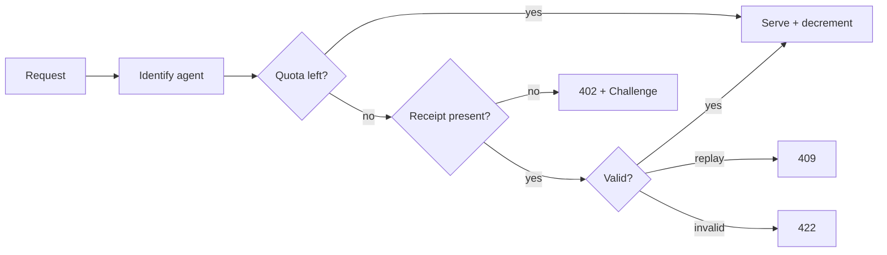

# AiFinPay Merchant Integration Guide

**Document:** AIFP Merchant Integration Guide
**Audience:** Backend engineers
**Status:** Stable
**Version:** 1.0.0
**Date:** June 28, 2026
**Contact:** developers@aifinpay.io · https://docs.aifinpay.io

> This is **Document 2 of 4** in the official AiFinPay documentation set:
>
> 1. [AIFP-1 — Payment Protocol Specification](./01-AIFP-1-RFC-Payment-Protocol-Specification.md) — the normative standard
> 2. **Merchant Integration Guide** *(this document)*
> 3. [AI Agent SDK Specification](./03-AI-Agent-SDK-Specification.md)
> 4. [Security & Cryptography Specification](./04-Security-and-Cryptography-Specification.md)
>
> This guide is **self-contained** for integration purposes. It conforms to AIFP-1; where protocol details are summarized here, the [AIFP-1 specification](./01-AIFP-1-RFC-Payment-Protocol-Specification.md) governs.

---

## Copyright Notice

Copyright © 2026 AiFinPay, Inc. Licensed under CC BY 4.0. Code samples are licensed Apache-2.0/MIT and may be used without attribution.

---

## Table of Contents

1. [Overview & Mental Model](#1-overview--mental-model)
2. [Core Concepts You Must Internalize](#2-core-concepts-you-must-internalize)
3. [The Integration Checklist](#3-the-integration-checklist)
4. [Pricing Engine & Free Quota](#4-pricing-engine--free-quota)
5. [Receipt Verification (the one thing you must get right)](#5-receipt-verification-the-one-thing-you-must-get-right)
6. [Framework Integrations](#6-framework-integrations)
   - [Express](#61-express-nodejs)
   - [Fastify](#62-fastify-nodejs)
   - [NestJS](#63-nestjs)
   - [Next.js](#64-nextjs)
   - [FastAPI](#65-fastapi-python)
   - [Django](#66-django-python)
   - [Laravel](#67-laravel-php)
   - [Spring Boot](#68-spring-boot-java)
   - [ASP.NET Core](#69-aspnet-core-c)
   - [Go (net/http + chi)](#610-go-nethttp--chi)
   - [Rust (Axum)](#611-rust-axum)
   - [Cloudflare Workers](#612-cloudflare-workers)
   - [NGINX](#613-nginx-njs--auth_request)
   - [Apache](#614-apache-httpd)
   - [WordPress](#615-wordpress-php-plugin)
7. [Error Handling & Retry](#7-error-handling--retry)
8. [Production Best Practices](#8-production-best-practices)
9. [Security](#9-security)
10. [Scaling](#10-scaling)
11. [Benchmarks](#11-benchmarks)
12. [Glossary](#12-glossary)
13. [References](#13-references)

---

# 1. Overview & Mental Model

You are a backend engineer. You have an API or content endpoint that AI agents hit. Today you either give it away free or block the bots. **AiFinPay lets you charge them, per request, automatically.**

Integration is one piece of middleware that does four things on every request:

1. **Identify** the agent (`AIFP-Agent-ID` header or fingerprint).
2. **Count** against a free quota (default 100 requests).
3. When quota is gone, **challenge** with `402 Payment Required` + a machine-readable payment challenge.
4. When the agent retries with a `Payment-Receipt`, **verify it locally** (Ed25519 signature — no network call) and serve the resource.



The crucial property: **the AiFinPay backend is never in your request hot path.** Quota lives in your cache; receipt verification is a local signature check. Your latency overhead is microseconds, and you keep serving even if AiFinPay is down (see [§8 degraded mode](#8-production-best-practices)).

---

# 2. Core Concepts You Must Internalize

| Concept | What it means for you |
|---|---|
| **Payment Challenge** | The JSON/`402` you return when quota is exhausted. Must include `nonce` + `expires_at`. |
| **Receipt Token** | An EdDSA-signed JWT the agent sends on retry. You verify it locally. |
| **Stateless verification** | Verify by signature + claims (`aud`, `resource`, `exp`, `amount`, `nonce`). No call to AiFinPay. |
| **Nonce store** | A short-TTL set (Redis/in-memory) preventing receipt replay. TTL = receipt TTL (~600s). |
| **Pricing Tier tier** | You tag each route `standard`/`standard`/`complex`/`premium` → price. |
| **Free quota** | First N requests per agent are free (default 100). |
| **JWKS** | AiFinPay's public keys. Cache them; refresh on unknown `kid`. |

Pricing defaults (override per route): **standard USD 0.00001 · standard USD 0.00001 · complex USD 0.00006 · premium USD 0.00010**.

JWKS endpoint: `https://api.aifinpay.io/v1/.well-known/jwks.json` — **cache it** (e.g., 1h), refresh on cache-miss of a `kid`.

---

# 3. The Integration Checklist

```text
[ ] Install the AiFinPay merchant SDK (or implement verification directly).
[ ] Set AIFP_MERCHANT_ID and AIFP_API_KEY from env.
[ ] Configure free quota (default 100) + per-route pricing_tier tiers.
[ ] Wire middleware: identify → quota → challenge / verify.
[ ] Cache JWKS; handle key rotation by kid.
[ ] Add a nonce store (Redis) for replay protection.
[ ] Map verification failures to 402 / 409 / 422 correctly.
[ ] Verify webhook signatures (HMAC-SHA256) if you consume webhooks.
[ ] Load-test; confirm degraded-mode behavior when AiFinPay is unreachable.
[ ] Ship behind TLS 1.3.
```

---

# 4. Pricing Engine & Free Quota

A merchant maps a request to a **pricing_tier tier**, which maps to a **price**. The simplest engine is a static route table; advanced setups use rules (method, path, query weight, payload size) and may consult the Dynamic Pricing Engine.

```ts
// pricing.ts — framework-agnostic
export type Pricing Tier = "standard" | "standard" | "complex" | "premium";

const PRICE: Record<Pricing Tier, string> = {
  standard: "0.01", standard: "0.04", complex: "0.08", premium: "0.10",
};

const ROUTE_TIER: { test: RegExp; tier: Pricing Tier }[] = [
  { test: /^\/api\/lookup\//, tier: "standard" },
  { test: /^\/api\/search/,   tier: "complex" },
  { test: /^\/api\/infer/,    tier: "premium" },
];

export function tierFor(path: string): Pricing Tier {
  return ROUTE_TIER.find(r => r.test.test(path))?.tier ?? "standard";
}
export function priceFor(path: string): string { return PRICE[tierFor(path)]; }

export const FREE_QUOTA = Number(process.env.AIFP_FREE_QUOTA ?? 100);
```

**Free quota** is a per-agent counter in your cache. Atomic decrement (Redis `INCR`/`DECR`) avoids race conditions under concurrency:

```ts
async function quotaRemaining(redis, agentId: string): Promise<number> {
  const used = await redis.incr(`aifp:quota:${agentId}`);
  if (used === 1) await redis.expire(`aifp:quota:${agentId}`, 60 * 60 * 24 * 30); // monthly window
  return FREE_QUOTA - used;
}
```

---

# 5. Receipt Verification (the one thing you must get right)

Every integration below ultimately calls one function. Get this right and the rest is glue. The canonical algorithm (AIFP-1 §7.4):

```ts
// verify.ts — the heart of every merchant integration
import { jwtVerify, createRemoteJWKSet } from "jose";

const JWKS = createRemoteJWKSet(new URL("https://api.aifinpay.io/v1/.well-known/jwks.json"));
const ISSUER = "https://api.aifinpay.io";

export type VerifyResult =
  | { ok: true; receiptId: string; nonce: string; exp: number }
  | { ok: false; status: 402 | 409 | 422; reason: string };

export async function verifyReceipt(opts: {
  token: string; merchantId: string; resource: string; requiredAmount: string;
  nonceSeen: (n: string) => Promise<boolean>;       // returns true if replay
  markNonce: (n: string, ttl: number) => Promise<void>;
}): Promise<VerifyResult> {
  let payload: any;
  try {
    ({ payload } = await jwtVerify(opts.token, JWKS, {
      issuer: ISSUER, audience: opts.merchantId, algorithms: ["EdDSA"],
      clockTolerance: 30, // seconds
    }));
  } catch { return { ok: false, status: 422, reason: "signature/exp/aud invalid" }; }

  if (payload.resource !== opts.resource)
    return { ok: false, status: 422, reason: "resource mismatch" };
  if (Number(payload.amount) < Number(opts.requiredAmount))
    return { ok: false, status: 422, reason: "amount below price" };

  if (await opts.nonceSeen(payload.nonce))
    return { ok: false, status: 409, reason: "receipt replay" };

  const ttl = Math.max(1, payload.exp - Math.floor(Date.now() / 1000));
  await opts.markNonce(payload.nonce, ttl);
  return { ok: true, receiptId: payload.receipt_id, nonce: payload.nonce, exp: payload.exp };
}
```

> **Why local?** Ed25519 verifies at ~50k ops/s/core. Verifying on your side means AiFinPay availability never gates your traffic, and you add only microseconds per request. This is non-negotiable for scale (AIFP-1 §4.2).

The Python equivalent (used by FastAPI/Django) and others mirror this exactly. Each framework section below shows the framework glue; the verification logic is always this algorithm.

---

# 6. Framework Integrations

> Every example: installs the SDK, configures env, adds middleware, returns a conformant `402` challenge, and verifies receipts locally. Replace `mrch_…` and keys with your own. All snippets are production-shaped (error handling, headers, nonce store).

## 6.1. Express (Node.js)

**Install**
```bash
npm install @aifinpay/merchant jose ioredis
```

**Middleware**
```ts
import express from "express";
import Redis from "ioredis";
import { verifyReceipt } from "./verify";
import { priceFor, tierFor, FREE_QUOTA } from "./pricing";
import crypto from "crypto";

const app = express();
const redis = new Redis(process.env.REDIS_URL!);
const MERCHANT_ID = process.env.AIFP_MERCHANT_ID!;

function challenge(res, resource: string) {
  const nonce = crypto.randomBytes(16).toString("hex");
  res.status(402)
    .set("AIFP-Payment-Required", "true")
    .set("Accept-Payment", "aifp/1.0")
    .json({
      error: { type: "payment_required", code: "AIFP-402", message: "Free quota exhausted." },
      payment_challenge: {
        version: "1.0", scheme: "aifp",
        quote_endpoint: "https://api.aifinpay.io/v1/quote",
        merchant_id: MERCHANT_ID, resource, pricing_tier: tierFor(resource),
        estimated_amount: priceFor(resource), currency: "USD",
        accepted_assets: ["USDC", "USDT", "PYUSD"],
        accepted_chains: ["polygon", "base", "solana"],
        nonce, expires_at: new Date(Date.now() + 300_000).toISOString(),
      },
    });
}

export async function aifp(req, res, next) {
  const resource = req.path;
  const agentId = req.header("AIFP-Agent-ID") || req.ip;

  const used = await redis.incr(`q:${agentId}`);
  if (used === 1) await redis.expire(`q:${agentId}`, 2592000);
  if (used <= FREE_QUOTA) return next();              // free tier

  const token = req.header("Payment-Receipt");
  if (!token) return challenge(res, resource);

  const r = await verifyReceipt({
    token, merchantId: MERCHANT_ID, resource, requiredAmount: priceFor(resource),
    nonceSeen: n => redis.exists(`n:${n}`).then(Boolean),
    markNonce: (n, ttl) => redis.set(`n:${n}`, "1", "EX", ttl).then(() => {}),
  });
  if (!r.ok) {
    if (r.status === 402) return challenge(res, resource);
    return res.status(r.status).json({ error: { code: `AIFP-${r.status}`, message: r.reason } });
  }
  next();
}

app.use(aifp);
app.get("/api/data", (_req, res) => res.json({ data: "premium content" }));
app.listen(3000);
```

## 6.2. Fastify (Node.js)

```bash
npm install fastify @aifinpay/merchant jose ioredis
```

```ts
import Fastify from "fastify";
import Redis from "ioredis";
import { verifyReceipt } from "./verify";
import { priceFor, tierFor, FREE_QUOTA } from "./pricing";
import crypto from "crypto";

const app = Fastify();
const redis = new Redis(process.env.REDIS_URL!);
const MERCHANT_ID = process.env.AIFP_MERCHANT_ID!;

app.addHook("onRequest", async (req, reply) => {
  const resource = req.url.split("?")[0];
  const agentId = (req.headers["aifp-agent-id"] as string) || req.ip;
  const used = await redis.incr(`q:${agentId}`);
  if (used === 1) await redis.expire(`q:${agentId}`, 2592000);
  if (used <= FREE_QUOTA) return;

  const token = req.headers["payment-receipt"] as string | undefined;
  const send402 = () => {
    const nonce = crypto.randomBytes(16).toString("hex");
    reply.code(402).headers({ "AIFP-Payment-Required": "true", "Accept-Payment": "aifp/1.0" }).send({
      error: { type: "payment_required", code: "AIFP-402", message: "Free quota exhausted." },
      payment_challenge: {
        version: "1.0", scheme: "aifp", quote_endpoint: "https://api.aifinpay.io/v1/quote",
        merchant_id: MERCHANT_ID, resource, pricing_tier: tierFor(resource),
        estimated_amount: priceFor(resource), currency: "USD", nonce,
        expires_at: new Date(Date.now() + 300_000).toISOString(),
      },
    });
  };
  if (!token) return send402();

  const r = await verifyReceipt({
    token, merchantId: MERCHANT_ID, resource, requiredAmount: priceFor(resource),
    nonceSeen: n => redis.exists(`n:${n}`).then(Boolean),
    markNonce: (n, ttl) => redis.set(`n:${n}`, "1", "EX", ttl).then(() => {}),
  });
  if (!r.ok) return r.status === 402 ? send402()
    : reply.code(r.status).send({ error: { code: `AIFP-${r.status}`, message: r.reason } });
});

app.get("/api/data", async () => ({ data: "premium content" }));
app.listen({ port: 3000 });
```

## 6.3. NestJS

```bash
npm install @nestjs/common @aifinpay/merchant jose ioredis
```

```ts
// aifp.guard.ts
import { CanActivate, ExecutionContext, Injectable } from "@nestjs/common";
import Redis from "ioredis";
import crypto from "crypto";
import { verifyReceipt } from "./verify";
import { priceFor, tierFor, FREE_QUOTA } from "./pricing";

@Injectable()
export class AifpGuard implements CanActivate {
  private redis = new Redis(process.env.REDIS_URL!);
  private MERCHANT_ID = process.env.AIFP_MERCHANT_ID!;

  async canActivate(ctx: ExecutionContext): Promise<boolean> {
    const req = ctx.switchToHttp().getRequest();
    const res = ctx.switchToHttp().getResponse();
    const resource = req.path;
    const agentId = req.headers["aifp-agent-id"] || req.ip;

    const used = await this.redis.incr(`q:${agentId}`);
    if (used === 1) await this.redis.expire(`q:${agentId}`, 2592000);
    if (used <= FREE_QUOTA) return true;

    const token = req.headers["payment-receipt"];
    const challenge = () => {
      const nonce = crypto.randomBytes(16).toString("hex");
      res.status(402).set("Accept-Payment", "aifp/1.0").json({
        error: { code: "AIFP-402", message: "Free quota exhausted." },
        payment_challenge: { version: "1.0", scheme: "aifp", merchant_id: this.MERCHANT_ID,
          resource, pricing_tier: tierFor(resource), estimated_amount: priceFor(resource),
          quote_endpoint: "https://api.aifinpay.io/v1/quote", nonce,
          expires_at: new Date(Date.now() + 300_000).toISOString() } });
      return false;
    };
    if (!token) return challenge();

    const r = await verifyReceipt({
      token, merchantId: this.MERCHANT_ID, resource, requiredAmount: priceFor(resource),
      nonceSeen: n => this.redis.exists(`n:${n}`).then(Boolean),
      markNonce: (n, ttl) => this.redis.set(`n:${n}`, "1", "EX", ttl).then(() => {}),
    });
    if (r.ok) return true;
    if (r.status === 402) return challenge();
    res.status(r.status).json({ error: { code: `AIFP-${r.status}`, message: r.reason } });
    return false;
  }
}
// usage: @UseGuards(AifpGuard) on a controller/route
```

## 6.4. Next.js

Use Edge Middleware so the check runs before the route. Receipt verification works at the edge (Web Crypto / `jose`).

```ts
// middleware.ts
import { NextRequest, NextResponse } from "next/server";
import { jwtVerify, createRemoteJWKSet } from "jose";

const JWKS = createRemoteJWKSet(new URL("https://api.aifinpay.io/v1/.well-known/jwks.json"));
const MERCHANT_ID = process.env.AIFP_MERCHANT_ID!;
const PRICE = { standard: "0.01", standard: "0.04", complex: "0.08", premium: "0.10" } as const;

export async function middleware(req: NextRequest) {
  const resource = req.nextUrl.pathname;
  if (!resource.startsWith("/api/")) return NextResponse.next();

  const token = req.headers.get("payment-receipt");
  const challenge = () => NextResponse.json({
    error: { code: "AIFP-402", message: "Payment required." },
    payment_challenge: { version: "1.0", scheme: "aifp", merchant_id: MERCHANT_ID, resource,
      pricing_tier: "standard", estimated_amount: PRICE.standard,
      quote_endpoint: "https://api.aifinpay.io/v1/quote",
      nonce: crypto.randomUUID(), expires_at: new Date(Date.now() + 300_000).toISOString() },
  }, { status: 402, headers: { "Accept-Payment": "aifp/1.0" } });

  // (quota check omitted for brevity — use Upstash Redis at edge)
  if (!token) return challenge();
  try {
    const { payload } = await jwtVerify(token, JWKS, {
      issuer: "https://api.aifinpay.io", audience: MERCHANT_ID, algorithms: ["EdDSA"], clockTolerance: 30,
    });
    if (payload.resource !== resource || Number(payload.amount) < Number(PRICE.standard))
      return NextResponse.json({ error: { code: "AIFP-422" } }, { status: 422 });
    return NextResponse.next();
  } catch { return challenge(); }
}
export const config = { matcher: "/api/:path*" };
```

## 6.5. FastAPI (Python)

```bash
pip install fastapi uvicorn "python-jose[cryptography]" httpx redis
```

```python
# aifp.py
import time, secrets, httpx
from fastapi import Request, HTTPException
from fastapi.responses import JSONResponse
from jose import jwt
from functools import lru_cache
import redis.asyncio as redis

MERCHANT_ID = "mrch_9f3a1c2b"
ISSUER = "https://api.aifinpay.io"
JWKS_URL = "https://api.aifinpay.io/v1/.well-known/jwks.json"
PRICE = {"standard": "0.01", "standard": "0.04", "complex": "0.08", "premium": "0.10"}
FREE_QUOTA = 100
r = redis.from_url("redis://localhost")

@lru_cache(maxsize=1)
def _jwks():
    return httpx.get(JWKS_URL, timeout=5).json()

def tier_for(path): return "standard"

def challenge(resource):
    return JSONResponse(status_code=402, headers={"Accept-Payment": "aifp/1.0"}, content={
        "error": {"code": "AIFP-402", "message": "Free quota exhausted."},
        "payment_challenge": {
            "version": "1.0", "scheme": "aifp", "merchant_id": MERCHANT_ID,
            "resource": resource, "pricing_tier": tier_for(resource),
            "estimated_amount": PRICE[tier_for(resource)],
            "quote_endpoint": f"{ISSUER}/v1/quote",
            "nonce": secrets.token_hex(16),
            "expires_at": time.strftime("%Y-%m-%dT%H:%M:%SZ", time.gmtime(time.time() + 300)),
        }})

async def aifp_middleware(request: Request, call_next):
    resource = request.url.path
    if not resource.startswith("/api/"):
        return await call_next(request)

    agent = request.headers.get("aifp-agent-id") or request.client.host
    used = await r.incr(f"q:{agent}")
    if used == 1: await r.expire(f"q:{agent}", 2592000)
    if used <= FREE_QUOTA:
        return await call_next(request)

    token = request.headers.get("payment-receipt")
    if not token:
        return challenge(resource)
    try:
        payload = jwt.decode(token, _jwks(), algorithms=["EdDSA"],
                             audience=MERCHANT_ID, issuer=ISSUER)
    except Exception:
        return challenge(resource)
    if payload.get("resource") != resource:
        return JSONResponse({"error": {"code": "AIFP-422"}}, status_code=422)
    if float(payload["amount"]) < float(PRICE[tier_for(resource)]):
        return JSONResponse({"error": {"code": "AIFP-422-AMOUNT"}}, status_code=422)
    if await r.exists(f"n:{payload['nonce']}"):
        return JSONResponse({"error": {"code": "AIFP-409"}}, status_code=409)
    await r.set(f"n:{payload['nonce']}", "1", ex=max(1, int(payload['exp'] - time.time())))
    return await call_next(request)
```
```python
# main.py
from fastapi import FastAPI
from aifp import aifp_middleware
app = FastAPI()
app.middleware("http")(aifp_middleware)

@app.get("/api/data")
async def data(): return {"data": "premium content"}
```

## 6.6. Django (Python)

```bash
pip install django "python-jose[cryptography]" httpx redis
```

```python
# aifp_middleware.py
import time, secrets, httpx
from django.http import JsonResponse
from jose import jwt
import redis

MERCHANT_ID = "mrch_9f3a1c2b"; ISSUER = "https://api.aifinpay.io"
JWKS = httpx.get("https://api.aifinpay.io/v1/.well-known/jwks.json", timeout=5).json()
PRICE = {"standard": "0.04"}; FREE_QUOTA = 100
R = redis.from_url("redis://localhost")

class AifpMiddleware:
    def __init__(self, get_response): self.get_response = get_response
    def __call__(self, request):
        resource = request.path
        if not resource.startswith("/api/"):
            return self.get_response(request)
        agent = request.headers.get("AIFP-Agent-ID") or request.META["REMOTE_ADDR"]
        used = R.incr(f"q:{agent}")
        if used == 1: R.expire(f"q:{agent}", 2592000)
        if used <= FREE_QUOTA:
            return self.get_response(request)
        token = request.headers.get("Payment-Receipt")
        if not token: return self._challenge(resource)
        try:
            p = jwt.decode(token, JWKS, algorithms=["EdDSA"], audience=MERCHANT_ID, issuer=ISSUER)
        except Exception:
            return self._challenge(resource)
        if p.get("resource") != resource or float(p["amount"]) < float(PRICE["standard"]):
            return JsonResponse({"error": {"code": "AIFP-422"}}, status=422)
        if R.exists(f"n:{p['nonce']}"):
            return JsonResponse({"error": {"code": "AIFP-409"}}, status=409)
        R.set(f"n:{p['nonce']}", "1", ex=max(1, int(p["exp"] - time.time())))
        return self.get_response(request)

    def _challenge(self, resource):
        return JsonResponse(status=402, headers={"Accept-Payment": "aifp/1.0"}, data={
            "error": {"code": "AIFP-402", "message": "Payment required."},
            "payment_challenge": {"version": "1.0", "scheme": "aifp", "merchant_id": MERCHANT_ID,
                "resource": resource, "pricing_tier": "standard", "estimated_amount": PRICE["standard"],
                "quote_endpoint": f"{ISSUER}/v1/quote", "nonce": secrets.token_hex(16),
                "expires_at": time.strftime("%Y-%m-%dT%H:%M:%SZ", time.gmtime(time.time()+300))}})
# settings.py: MIDDLEWARE = [..., "aifp_middleware.AifpMiddleware"]
```

## 6.7. Laravel (PHP)

```bash
composer require firebase/php-jwt predis/predis guzzlehttp/guzzle
```

```php
<?php // app/Http/Middleware/Aifp.php
namespace App\Http\Middleware;
use Closure; use Illuminate\Http\Request;
use Firebase\JWT\JWT; use Firebase\JWT\JWK;
use Predis\Client as Redis;

class Aifp {
    private string $merchant = 'mrch_9f3a1c2b';
    private string $issuer = 'https://api.aifinpay.io';
    private array $price = ['standard' => '0.04'];
    private int $quota = 100;

    public function handle(Request $req, Closure $next) {
        $resource = $req->getPathInfo();
        if (!str_starts_with($resource, '/api/')) return $next($req);
        $redis = new Redis();
        $agent = $req->header('AIFP-Agent-ID') ?? $req->ip();
        $used = $redis->incr("q:$agent");
        if ($used === 1) $redis->expire("q:$agent", 2592000);
        if ($used <= $this->quota) return $next($req);

        $token = $req->header('Payment-Receipt');
        if (!$token) return $this->challenge($resource);
        try {
            $jwks = json_decode(file_get_contents("$this->issuer/v1/.well-known/jwks.json"), true);
            $p = (array) JWT::decode($token, JWK::parseKeySet($jwks));
        } catch (\Throwable $e) { return $this->challenge($resource); }
        if (($p['aud'] ?? '') !== $this->merchant || ($p['resource'] ?? '') !== $resource)
            return response()->json(['error' => ['code' => 'AIFP-422']], 422);
        if ((float)$p['amount'] < (float)$this->price['standard'])
            return response()->json(['error' => ['code' => 'AIFP-422-AMOUNT']], 422);
        if ($redis->exists("n:{$p['nonce']}"))
            return response()->json(['error' => ['code' => 'AIFP-409']], 409);
        $redis->setex("n:{$p['nonce']}", max(1, $p['exp'] - time()), '1');
        return $next($req);
    }

    private function challenge(string $resource) {
        return response()->json([
            'error' => ['code' => 'AIFP-402', 'message' => 'Payment required.'],
            'payment_challenge' => ['version' => '1.0', 'scheme' => 'aifp',
                'merchant_id' => $this->merchant, 'resource' => $resource, 'pricing_tier' => 'standard',
                'estimated_amount' => $this->price['standard'],
                'quote_endpoint' => "$this->issuer/v1/quote", 'nonce' => bin2hex(random_bytes(16)),
                'expires_at' => gmdate('Y-m-d\TH:i:s\Z', time() + 300)],
        ], 402)->header('Accept-Payment', 'aifp/1.0');
    }
}
```

## 6.8. Spring Boot (Java)

```xml
<!-- pom.xml -->
<dependency><groupId>com.nimbusds</groupId><artifactId>nimbus-jose-jwt</artifactId><version>9.40</version></dependency>
<dependency><groupId>org.springframework.boot</groupId><artifactId>spring-boot-starter-data-redis</artifactId></dependency>
```

```java
// AifpFilter.java
@Component
public class AifpFilter extends OncePerRequestFilter {
  private static final String MERCHANT = "mrch_9f3a1c2b";
  private static final String ISSUER = "https://api.aifinpay.io";
  private static final long QUOTA = 100;
  @Autowired StringRedisTemplate redis;
  private final JWKSource<SecurityContext> jwks =
      JWKSourceBuilder.create(new URL(ISSUER + "/v1/.well-known/jwks.json")).build();

  @Override protected void doFilterInternal(HttpServletRequest req, HttpServletResponse res, FilterChain chain)
      throws ServletException, IOException {
    String resource = req.getRequestURI();
    if (!resource.startsWith("/api/")) { chain.doFilter(req, res); return; }
    String agent = Optional.ofNullable(req.getHeader("AIFP-Agent-ID")).orElse(req.getRemoteAddr());
    Long used = redis.opsForValue().increment("q:" + agent);
    if (used != null && used == 1) redis.expire("q:" + agent, Duration.ofDays(30));
    if (used != null && used <= QUOTA) { chain.doFilter(req, res); return; }

    String token = req.getHeader("Payment-Receipt");
    if (token == null) { challenge(res, resource); return; }
    try {
      ConfigurableJWTProcessor<SecurityContext> p = new DefaultJWTProcessor<>();
      p.setJWSKeySelector(new JWSVerificationKeySelector<>(JWSAlgorithm.EdDSA, jwks));
      JWTClaimsSet c = p.process(token, null);
      if (!MERCHANT.equals(c.getAudience().get(0)) || !resource.equals(c.getStringClaim("resource")))
        { res.setStatus(422); return; }
      if (Double.parseDouble(c.getStringClaim("amount")) < 0.04) { res.setStatus(422); return; }
      String nonce = c.getStringClaim("nonce");
      if (Boolean.TRUE.equals(redis.hasKey("n:" + nonce))) { res.setStatus(409); return; }
      long ttl = Math.max(1, c.getExpirationTime().getTime()/1000 - System.currentTimeMillis()/1000);
      redis.opsForValue().set("n:" + nonce, "1", Duration.ofSeconds(ttl));
      chain.doFilter(req, res);
    } catch (Exception e) { challenge(res, resource); }
  }

  private void challenge(HttpServletResponse res, String resource) throws IOException {
    res.setStatus(402); res.setHeader("Accept-Payment", "aifp/1.0");
    res.setContentType("application/json");
    res.getWriter().write("{\"error\":{\"code\":\"AIFP-402\"},\"payment_challenge\":{\"version\":\"1.0\",\"scheme\":\"aifp\",\"merchant_id\":\""
      + MERCHANT + "\",\"resource\":\"" + resource + "\",\"pricing_tier\":\"standard\",\"estimated_amount\":\"0.04\",\"quote_endpoint\":\""
      + ISSUER + "/v1/quote\"}}");
  }
}
```

## 6.9. ASP.NET Core (C#)

```bash
dotnet add package Microsoft.IdentityModel.Tokens
dotnet add package System.IdentityModel.Tokens.Jwt
dotnet add package StackExchange.Redis
```

```csharp
// AifpMiddleware.cs
public class AifpMiddleware {
    private const string Merchant = "mrch_9f3a1c2b";
    private const string Issuer = "https://api.aifinpay.io";
    private const long Quota = 100;
    private readonly RequestDelegate _next;
    private readonly IDatabase _redis;
    public AifpMiddleware(RequestDelegate next, IConnectionMultiplexer mux) { _next = next; _redis = mux.GetDatabase(); }

    public async Task Invoke(HttpContext ctx) {
        var resource = ctx.Request.Path.Value ?? "/";
        if (!resource.StartsWith("/api/")) { await _next(ctx); return; }
        var agent = ctx.Request.Headers["AIFP-Agent-ID"].FirstOrDefault() ?? ctx.Connection.RemoteIpAddress?.ToString() ?? "anon";
        var used = await _redis.StringIncrementAsync($"q:{agent}");
        if (used == 1) await _redis.KeyExpireAsync($"q:{agent}", TimeSpan.FromDays(30));
        if (used <= Quota) { await _next(ctx); return; }

        var token = ctx.Request.Headers["Payment-Receipt"].FirstOrDefault();
        if (token is null) { await Challenge(ctx, resource); return; }
        try {
            var jwks = await new HttpClient().GetStringAsync($"{Issuer}/v1/.well-known/jwks.json");
            var keys = new JsonWebKeySet(jwks).GetSigningKeys();
            var handler = new JwtSecurityTokenHandler();
            var principal = handler.ValidateToken(token, new TokenValidationParameters {
                ValidIssuer = Issuer, ValidAudience = Merchant, IssuerSigningKeys = keys,
                ClockSkew = TimeSpan.FromSeconds(30)
            }, out _);
            var claims = principal.Claims.ToDictionary(c => c.Type, c => c.Value);
            if (claims["resource"] != resource || double.Parse(claims["amount"]) < 0.04) { ctx.Response.StatusCode = 422; return; }
            if (await _redis.KeyExistsAsync($"n:{claims["nonce"]}")) { ctx.Response.StatusCode = 409; return; }
            await _redis.StringSetAsync($"n:{claims["nonce"]}", "1", TimeSpan.FromSeconds(600));
            await _next(ctx);
        } catch { await Challenge(ctx, resource); }
    }

    private static async Task Challenge(HttpContext ctx, string resource) {
        ctx.Response.StatusCode = 402;
        ctx.Response.Headers["Accept-Payment"] = "aifp/1.0";
        await ctx.Response.WriteAsJsonAsync(new {
            error = new { code = "AIFP-402" },
            payment_challenge = new { version = "1.0", scheme = "aifp", merchant_id = Merchant,
                resource, pricing_tier = "standard", estimated_amount = "0.04",
                quote_endpoint = $"{Issuer}/v1/quote" } });
    }
}
// app.UseMiddleware<AifpMiddleware>();
```

## 6.10. Go (net/http + chi)

```bash
go get github.com/go-chi/chi/v5 github.com/golang-jwt/jwt/v5 github.com/redis/go-redis/v9
```

```go
package aifp

import (
	"encoding/json"; "net/http"; "strconv"; "time"
	"github.com/golang-jwt/jwt/v5"
	"github.com/redis/go-redis/v9"
)

const (
	merchant = "mrch_9f3a1c2b"
	issuer   = "https://api.aifinpay.io"
	quota    = 100
)

func Middleware(rdb *redis.Client, keyfunc jwt.Keyfunc) func(http.Handler) http.Handler {
	return func(next http.Handler) http.Handler {
		return http.HandlerFunc(func(w http.ResponseWriter, r *http.Request) {
			ctx := r.Context()
			resource := r.URL.Path
			agent := r.Header.Get("AIFP-Agent-ID")
			if agent == "" { agent = r.RemoteAddr }
			used, _ := rdb.Incr(ctx, "q:"+agent).Result()
			if used == 1 { rdb.Expire(ctx, "q:"+agent, 30*24*time.Hour) }
			if used <= quota { next.ServeHTTP(w, r); return }

			token := r.Header.Get("Payment-Receipt")
			if token == "" { challenge(w, resource); return }
			tok, err := jwt.Parse(token, keyfunc, jwt.WithValidMethods([]string{"EdDSA"}),
				jwt.WithIssuer(issuer), jwt.WithAudience(merchant))
			if err != nil || !tok.Valid { challenge(w, resource); return }
			c := tok.Claims.(jwt.MapClaims)
			if c["resource"] != resource { w.WriteHeader(422); return }
			amt, _ := strconv.ParseFloat(c["amount"].(string), 64)
			if amt < 0.04 { w.WriteHeader(422); return }
			nonce := c["nonce"].(string)
			if n, _ := rdb.Exists(ctx, "n:"+nonce).Result(); n == 1 { w.WriteHeader(409); return }
			rdb.Set(ctx, "n:"+nonce, "1", 600*time.Second)
			next.ServeHTTP(w, r)
		})
	}
}

func challenge(w http.ResponseWriter, resource string) {
	w.Header().Set("Accept-Payment", "aifp/1.0")
	w.Header().Set("Content-Type", "application/json")
	w.WriteHeader(402)
	json.NewEncoder(w).Encode(map[string]any{
		"error": map[string]string{"code": "AIFP-402"},
		"payment_challenge": map[string]any{"version": "1.0", "scheme": "aifp",
			"merchant_id": merchant, "resource": resource, "pricing_tier": "standard",
			"estimated_amount": "0.04", "quote_endpoint": issuer + "/v1/quote",
			"expires_at": time.Now().Add(5 * time.Minute).UTC().Format(time.RFC3339)},
	})
}
```

## 6.11. Rust (Axum)

```toml
# Cargo.toml
axum = "0.7"
jsonwebtoken = "9"
redis = { version = "0.25", features = ["tokio-comp"] }
serde_json = "1"
tokio = { version = "1", features = ["full"] }
```

```rust
use axum::{extract::Request, http::StatusCode, middleware::Next, response::{IntoResponse, Response}, Json};
use jsonwebtoken::{decode, DecodingKey, Validation, Algorithm};
use serde::Deserialize;
use serde_json::json;

const MERCHANT: &str = "mrch_9f3a1c2b";
const ISSUER: &str = "https://api.aifinpay.io";

#[derive(Deserialize)]
struct Claims { aud: String, resource: String, amount: String, nonce: String, exp: usize }

pub async fn aifp(req: Request, next: Next) -> Response {
    let resource = req.uri().path().to_string();
    if !resource.starts_with("/api/") { return next.run(req).await; }

    // (quota check via Redis omitted for brevity)
    let token = req.headers().get("payment-receipt").and_then(|v| v.to_str().ok());
    let Some(token) = token else { return challenge(&resource); };

    let key = DecodingKey::from_ed_pem(/* fetched JWKS PEM */ b"").unwrap();
    let mut v = Validation::new(Algorithm::EdDSA);
    v.set_audience(&[MERCHANT]); v.set_issuer(&[ISSUER]); v.leeway = 30;
    match decode::<Claims>(token, &key, &v) {
        Ok(data) if data.claims.resource == resource
            && data.claims.amount.parse::<f64>().unwrap_or(0.0) >= 0.04 => next.run(req).await,
        Ok(_) => StatusCode::UNPROCESSABLE_ENTITY.into_response(),
        Err(_) => challenge(&resource),
    }
}

fn challenge(resource: &str) -> Response {
    (StatusCode::PAYMENT_REQUIRED, [("Accept-Payment", "aifp/1.0")],
     Json(json!({ "error": {"code":"AIFP-402"},
        "payment_challenge": {"version":"1.0","scheme":"aifp","merchant_id":MERCHANT,
            "resource":resource,"pricing_tier":"standard","estimated_amount":"0.04",
            "quote_endpoint": format!("{ISSUER}/v1/quote")} }))).into_response()
}
```

## 6.12. Cloudflare Workers

Verification runs at the edge with Web Crypto; quota via Workers KV / Durable Objects.

```ts
import { jwtVerify, createRemoteJWKSet } from "jose";
const JWKS = createRemoteJWKSet(new URL("https://api.aifinpay.io/v1/.well-known/jwks.json"));
const MERCHANT = "mrch_9f3a1c2b";

export default {
  async fetch(req: Request, env: Env): Promise<Response> {
    const url = new URL(req.url);
    if (!url.pathname.startsWith("/api/")) return fetch(req);

    const agent = req.headers.get("AIFP-Agent-ID") ?? req.headers.get("cf-connecting-ip")!;
    const used = Number(await env.QUOTA.get(`q:${agent}`) ?? "0") + 1;
    await env.QUOTA.put(`q:${agent}`, String(used), { expirationTtl: 2592000 });
    if (used <= 100) return fetch(req);

    const token = req.headers.get("Payment-Receipt");
    const challenge = () => new Response(JSON.stringify({
      error: { code: "AIFP-402" },
      payment_challenge: { version: "1.0", scheme: "aifp", merchant_id: MERCHANT,
        resource: url.pathname, pricing_tier: "standard", estimated_amount: "0.04",
        quote_endpoint: "https://api.aifinpay.io/v1/quote", nonce: crypto.randomUUID(),
        expires_at: new Date(Date.now() + 300000).toISOString() } }),
      { status: 402, headers: { "Accept-Payment": "aifp/1.0", "Content-Type": "application/json" } });
    if (!token) return challenge();
    try {
      const { payload } = await jwtVerify(token, JWKS, {
        issuer: "https://api.aifinpay.io", audience: MERCHANT, algorithms: ["EdDSA"], clockTolerance: 30 });
      if (payload.resource !== url.pathname) return new Response(null, { status: 422 });
      if (await env.NONCE.get(`n:${payload.nonce}`)) return new Response(null, { status: 409 });
      await env.NONCE.put(`n:${payload.nonce}`, "1", { expirationTtl: 600 });
      return fetch(req);
    } catch { return challenge(); }
  },
};
```

## 6.13. NGINX (njs + auth_request)

Offload verification to an internal subrequest handled by an njs module.

```nginx
# nginx.conf
load_module modules/ngx_http_js_module.so;
http {
  js_import aifp from /etc/nginx/aifp.js;
  server {
    location /api/ {
      auth_request /_aifp_verify;
      error_page 402 = @challenge;
      proxy_pass http://backend;
    }
    location = /_aifp_verify { internal; js_content aifp.verify; }
    location @challenge { js_content aifp.challenge; }
  }
}
```

```js
// /etc/nginx/aifp.js  (njs)
import qs from "querystring";
const MERCHANT = "mrch_9f3a1c2b";
// njs has limited crypto; for EdDSA verification, proxy the token to a tiny sidecar
// (e.g. a local Go/Node verifier on 127.0.0.1:8787) that returns 204/402/409/422.
async function verify(r) {
  const token = r.headersIn["Payment-Receipt"];
  if (!token) { r.return(402); return; }
  const resp = await ngx.fetch("http://127.0.0.1:8787/verify", {
    method: "POST",
    headers: { "Content-Type": "application/json" },
    body: JSON.stringify({ token, resource: r.uri, merchant: MERCHANT }),
  });
  r.return(resp.status === 200 ? 204 : resp.status);
}
function challenge(r) {
  r.headersOut["Accept-Payment"] = "aifp/1.0";
  r.headersOut["Content-Type"] = "application/json";
  r.return(402, JSON.stringify({ error: { code: "AIFP-402" },
    payment_challenge: { version: "1.0", scheme: "aifp", merchant_id: MERCHANT,
      resource: r.uri, pricing_tier: "standard", estimated_amount: "0.04",
      quote_endpoint: "https://api.aifinpay.io/v1/quote" } }));
}
export default { verify, challenge };
```

> **Pattern:** edge proxies (NGINX/Apache) that lack native EdDSA delegate the signature check to a small local **verifier sidecar** (a stripped Go/Node service running [§5](#5-receipt-verification-the-one-thing-you-must-get-right)). This keeps verification local (no AiFinPay round-trip) while staying within the proxy's capabilities.

## 6.14. Apache (httpd)

Use `mod_auth_request`-style delegation via `mod_rewrite` + a verifier sidecar, or `mod_lua`.

```apache
# httpd.conf  (mod_lua)
LuaHookAuthChecker /etc/httpd/aifp.lua aifp_check
<Location "/api/">
  Require valid-aifp
</Location>
```

```lua
-- /etc/httpd/aifp.lua
local http = require "socket.http"
local ltn12 = require "ltn12"
local cjson = require "cjson"
local MERCHANT = "mrch_9f3a1c2b"

function aifp_check(r)
  local token = r.headers_in["Payment-Receipt"]
  if not token then return challenge(r) end
  local body = cjson.encode({ token = token, resource = r.uri, merchant = MERCHANT })
  local resp = {}
  local _, code = http.request{
    url = "http://127.0.0.1:8787/verify", method = "POST",
    headers = { ["Content-Type"] = "application/json", ["Content-Length"] = #body },
    source = ltn12.source.string(body), sink = ltn12.sink.table(resp),
  }
  if code == 200 then return apache2.OK else return challenge(r) end
end

function challenge(r)
  r.status = 402
  r.headers_out["Accept-Payment"] = "aifp/1.0"
  r.content_type = "application/json"
  r:write(cjson.encode({ error = { code = "AIFP-402" },
    payment_challenge = { version = "1.0", scheme = "aifp", merchant_id = MERCHANT,
      resource = r.uri, pricing_tier = "standard", estimated_amount = "0.04",
      quote_endpoint = "https://api.aifinpay.io/v1/quote" } }))
  return 402
end
```

## 6.15. WordPress (PHP plugin)

```php
<?php
/* Plugin Name: AiFinPay Paywall */
add_action('init', function () {
    if (strpos($_SERVER['REQUEST_URI'], '/wp-json/') === false) return;
    require_once __DIR__ . '/vendor/autoload.php';
    use Firebase\JWT\JWT; use Firebase\JWT\JWK;

    $merchant = get_option('aifp_merchant_id', 'mrch_9f3a1c2b');
    $issuer   = 'https://api.aifinpay.io';
    $resource = parse_url($_SERVER['REQUEST_URI'], PHP_URL_PATH);

    $agent = $_SERVER['HTTP_AIFP_AGENT_ID'] ?? $_SERVER['REMOTE_ADDR'];
    $key   = "aifp_q_" . md5($agent);
    $used  = (int) get_transient($key) + 1;
    set_transient($key, $used, MONTH_IN_SECONDS);
    if ($used <= 100) return;

    $token = $_SERVER['HTTP_PAYMENT_RECEIPT'] ?? null;
    $challenge = function () use ($merchant, $issuer, $resource) {
        status_header(402);
        header('Accept-Payment: aifp/1.0');
        header('Content-Type: application/json');
        echo json_encode(['error' => ['code' => 'AIFP-402'],
            'payment_challenge' => ['version' => '1.0', 'scheme' => 'aifp',
                'merchant_id' => $merchant, 'resource' => $resource, 'pricing_tier' => 'standard',
                'estimated_amount' => '0.04', 'quote_endpoint' => "$issuer/v1/quote",
                'nonce' => bin2hex(random_bytes(16)),
                'expires_at' => gmdate('Y-m-d\TH:i:s\Z', time() + 300)]]);
        exit;
    };
    if (!$token) $challenge();
    try {
        $jwks = json_decode(file_get_contents("$issuer/v1/.well-known/jwks.json"), true);
        $p = (array) JWT::decode($token, JWK::parseKeySet($jwks));
    } catch (\Throwable $e) { $challenge(); }
    if (($p['aud'] ?? '') !== $merchant || ($p['resource'] ?? '') !== $resource
        || (float)($p['amount'] ?? 0) < 0.04) { status_header(422); exit; }
    $nkey = "aifp_n_" . $p['nonce'];
    if (get_transient($nkey)) { status_header(409); exit; }
    set_transient($nkey, 1, max(1, $p['exp'] - time()));
});
```

---

# 7. Error Handling & Retry

Map verification outcomes to the correct HTTP code — agents depend on this (AIFP-1 §17):

| Outcome | Return | Agent reaction |
|---|---|---|
| No receipt, quota gone | `402` + challenge | Pay, then retry |
| Signature/aud/exp invalid | `422` | Re-quote, re-pay |
| Amount below price | `422-AMOUNT` | Re-quote at correct tier |
| Nonce reused | `409` | Get a **fresh** receipt |
| Expired receipt | `402` | Pay again |
| Settlement not confirmed (high-value) | `425` + `Retry-After` | Wait, retry same receipt |
| Rate limited | `429` + `Retry-After` | Backoff |

Always include a structured body: `{ "error": { "type", "code", "message", "request_id", "doc" } }`. Never leak stack traces.

---

# 8. Production Best Practices

- **Cache JWKS** with a TTL (e.g., 1h) and refresh on an unknown `kid` (key rotation). Never fetch JWKS per request.
- **Degraded mode:** if AiFinPay is unreachable, keep honoring valid unexpired receipts. Verification is local — it does not need AiFinPay to be up.
- **Atomic quota:** use Redis `INCR` with a TTL window, never read-modify-write.
- **Nonce store sizing:** TTL = receipt TTL (~600s). At any instant you only store nonces seen in the last ~10 min, so the set stays tiny even at billions/day.
- **Clock skew:** allow ≤30s tolerance on `exp`.
- **Idempotent challenges:** issuing a `402` must never consume quota or mutate state.
- **Observability:** emit `aifp_402_total`, `aifp_verify_fail_total{reason}`, `aifp_receipt_redeemed_total`, p99 verify latency.
- **Webhooks:** verify `AIFP-Signature` (HMAC-SHA256) + 5-min timestamp window before trusting any webhook.

---

# 9. Security

- **TLS 1.3 only.** All traffic, including receipt retries.
- **Verify everything by signature.** Never trust a receipt you did not cryptographically verify against the current JWKS.
- **Bind tightly.** Always check `aud == your merchant_id` and `resource == requested path`. A receipt for resource A MUST NOT unlock resource B.
- **Replay-proof.** A nonce store is mandatory; without it, a captured receipt could be reused until expiry.
- **Secrets hygiene.** Keep `sk_live_*` server-side only; rotate on exposure. Use `pk_live_*` for any client-exposed config.
- **Rate limit** the challenge path to blunt nonce-harvesting and DoS.
- Full guidance: [Security & Cryptography Specification](./04-Security-and-Cryptography-Specification.md).

---

# 10. Scaling

| Concern | Approach |
|---|---|
| Verification throughput | Local Ed25519 (~50k/s/core); scale horizontally, no backend dependency |
| Quota counters | Redis cluster / Workers KV; shard by agent id |
| Nonce store | Short-TTL Redis; memory bounded by TTL window |
| Edge | Verify at CDN edge (Cloudflare/Next middleware) for single-digit-ms overhead |
| Hot keys | Consistent hashing; local LRU for JWKS |
| Multi-region | JWKS is global & cacheable; nonce store can be regional with sticky agent routing |

---

# 11. Benchmarks

Representative figures on a single modern core (illustrative, your numbers will vary):

| Operation | Throughput | p99 latency |
|---|---|---|
| Ed25519 receipt verify (warm JWKS) | ~50,000 /s/core | < 40 µs |
| Quota `INCR` (local Redis) | ~120,000 /s | < 0.4 ms |
| Nonce check + set (Redis) | ~90,000 /s | < 0.6 ms |
| End-to-end middleware overhead | — | < 1 ms added |

The dominant cost is your own business logic, not AIFP. The protocol adds sub-millisecond overhead per request.

---

# 12. Glossary

See AIFP-1 [Appendix A](./01-AIFP-1-RFC-Payment-Protocol-Specification.md#appendix-a-glossary) for the canonical glossary. Key merchant terms: **Payment Challenge**, **Receipt Token**, **Stateless Verification**, **Free Quota**, **Pricing Tier Tier**, **Nonce Store**, **JWKS**, **kid**, **Degraded Mode**.

---

# 13. References

- [AIFP-1 — Payment Protocol Specification](./01-AIFP-1-RFC-Payment-Protocol-Specification.md) (normative).
- [AI Agent SDK Specification](./03-AI-Agent-SDK-Specification.md) — the client side that pays you.
- [Security & Cryptography Specification](./04-Security-and-Cryptography-Specification.md).
- [RFC 7519] JWT · [RFC 8037] EdDSA in JOSE · [RFC 9110] HTTP Semantics.

---

*End of Merchant Integration Guide. © 2026 AiFinPay, Inc. Licensed CC BY 4.0.*
