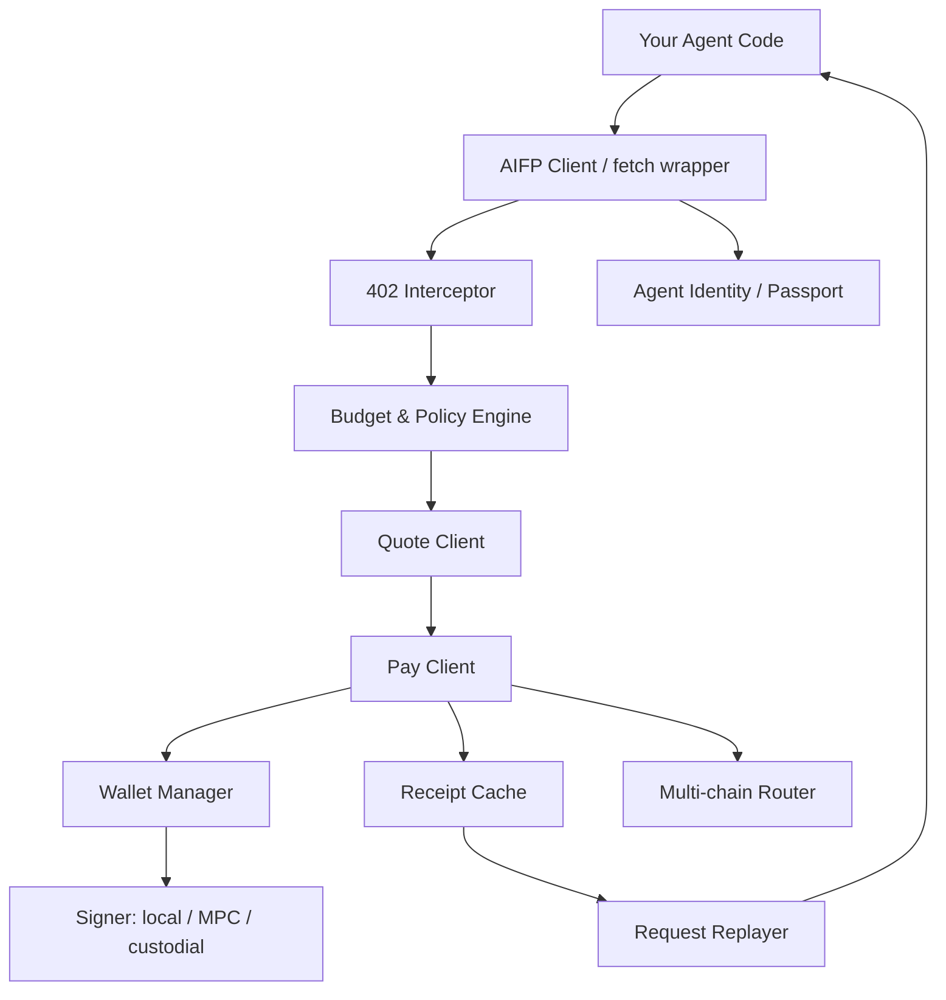
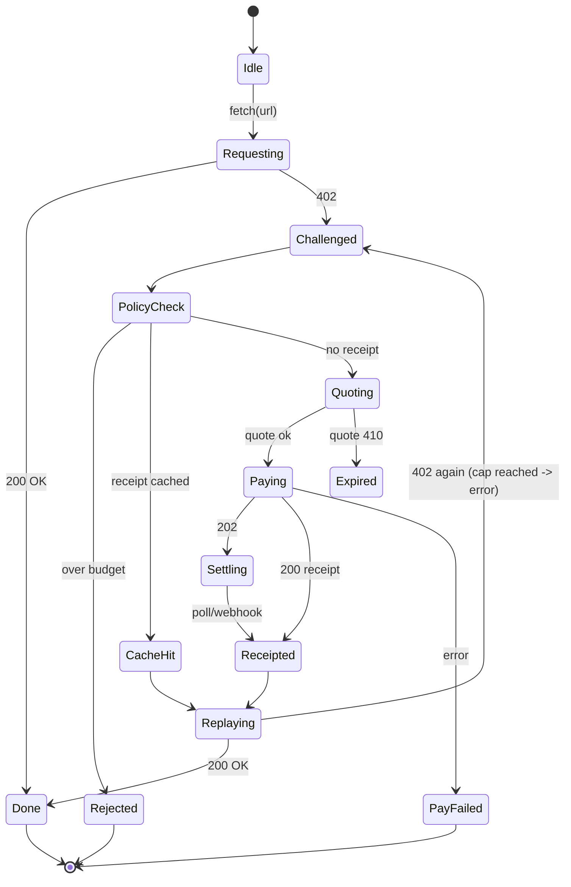
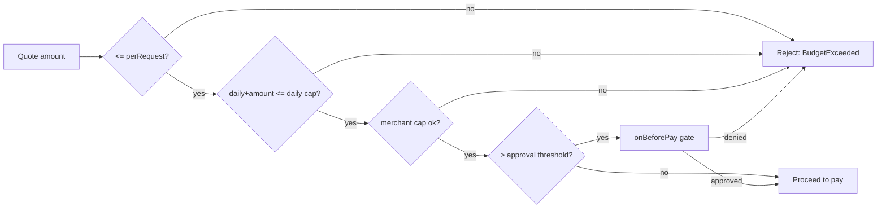
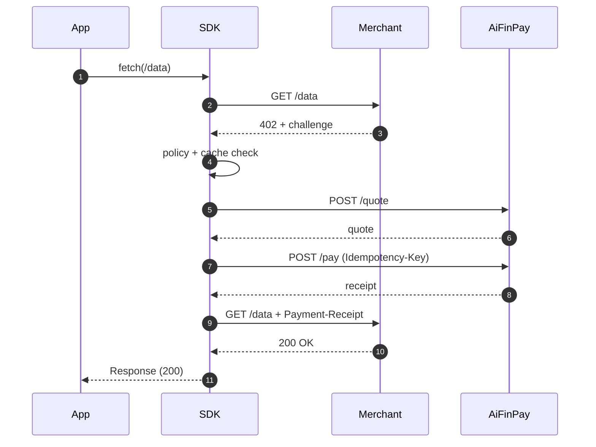
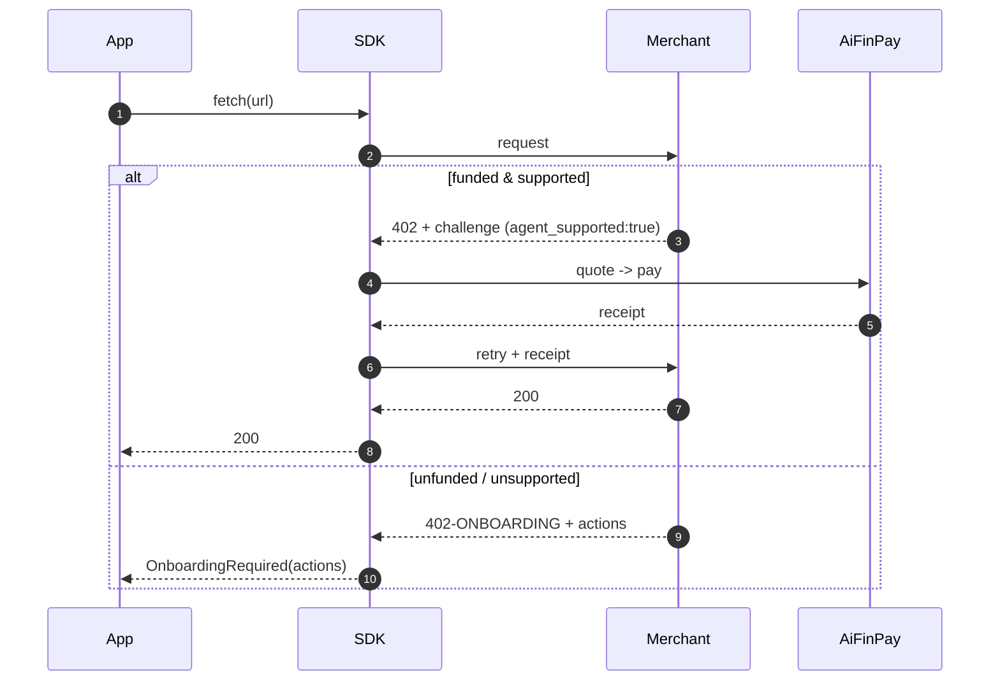

# AiFinPay AI Agent SDK Specification

**Document:** AIFP AI Agent SDK Specification
**Audience:** AI agent developers
**Status:** Stable
**Version:** 1.0.0
**Date:** June 28, 2026
**Contact:** developers@aifinpay.io · https://docs.aifinpay.io/agents

> This is **Document 3 of 4** in the official AiFinPay documentation set:
>
> 1. [AIFP-1 — Payment Protocol Specification](./01-AIFP-1-RFC-Payment-Protocol-Specification.md) — the normative standard
> 2. [Merchant Integration Guide](./02-Merchant-Integration-Guide.md)
> 3. **AI Agent SDK Specification** *(this document)*
> 4. [Security & Cryptography Specification](./04-Security-and-Cryptography-Specification.md)
>
> This document is **self-contained** for agent developers. It conforms to AIFP-1; where wire-protocol details are summarized, the [AIFP-1 specification](./01-AIFP-1-RFC-Payment-Protocol-Specification.md) governs.

---

## Copyright Notice

Copyright © 2026 AiFinPay, Inc. Licensed under CC BY 4.0. Code samples are Apache-2.0/MIT.

---

## Table of Contents

1. [What the SDK Does](#1-what-the-sdk-does)
2. [SDK Architecture](#2-sdk-architecture)
3. [Installation & Quickstart](#3-installation--quickstart)
4. [The Automatic Payment Flow](#4-the-automatic-payment-flow)
5. [SDK State Machine & Lifecycle](#5-sdk-state-machine--lifecycle)
6. [Wallet Management & Multi-Wallet](#6-wallet-management--multi-wallet)
7. [Budget Control & Spending Policies](#7-budget-control--spending-policies)
8. [Multi-Chain Routing](#8-multi-chain-routing)
9. [Agent Identity & Agent Passport](#9-agent-identity--agent-passport)
10. [Core API Surface](#10-core-api-surface)
11. [Quote API · Pay API · Receipt Verification](#11-quote-api--pay-api--receipt-verification)
12. [Automatic Request Replay & Error Recovery](#12-automatic-request-replay--error-recovery)
13. [x402 Compatibility & Migration API](#13-x402-compatibility--migration-api)
14. [AI Wallet Onboarding](#14-ai-wallet-onboarding)
15. [Language SDKs](#15-language-sdks)
    - [TypeScript](#151-typescript)
    - [Python](#152-python)
    - [Go](#153-go)
    - [Rust](#154-rust)
    - [Java](#155-java)
    - [C#](#156-c)
    - [PHP](#157-php)
16. [Sequence & State Diagrams](#16-sequence--state-diagrams)
17. [Best Practices](#17-best-practices)
18. [Glossary](#18-glossary)
19. [References](#19-references)

---

# 1. What the SDK Does

You are building an AI agent — an LLM tool-caller, a crawler, a RAG pipeline. It hits APIs. Some of those APIs now answer with **`402 Payment Required`**. The AiFinPay Agent SDK makes that a non-event: it **detects the 402, pays automatically, and replays the request** — your application code just sees a successful response.

```ts
// With the SDK, this "just works" even against paid endpoints:
const res = await aifp.fetch("https://api.example.com/data");
const json = await res.json(); // SDK paid the 402 transparently and retried
```

The SDK owns: wallet handling, budget enforcement, quote/pay calls, receipt caching, the retry/replay loop, multi-chain routing, agent identity (Passport), and x402 migration. Your code owns: the request you wanted to make.

<a name="agent-passport"></a>

---

# 2. SDK Architecture



| Layer | Responsibility |
|---|---|
| **Client / fetch wrapper** | Drop-in replacement for `fetch`/HTTP client |
| **402 Interceptor** | Detects `402`, parses the Payment Challenge |
| **Budget & Policy Engine** | Approves/denies a payment against spending policy |
| **Quote Client** | `POST /quote` to get a binding price |
| **Pay Client** | `POST /pay` (idempotent) to settle |
| **Wallet Manager** | Holds wallets, selects funding source, signs |
| **Receipt Cache** | Caches valid receipts to skip re-payment within TTL |
| **Request Replayer** | Re-issues the original request with `Payment-Receipt` |
| **Multi-chain Router** | Picks chain/asset by cost, speed, balance |
| **Agent Identity** | Carries `AIFP-Agent-ID` and optional Passport |

---

# 3. Installation & Quickstart

```bash
npm install @aifinpay/agent      # TypeScript / Node
pip install aifinpay-agent       # Python
go get github.com/aifinpay/agent-go
cargo add aifinpay-agent         # Rust
# Java (Maven), C# (NuGet), PHP (Composer) — see §15
```

```ts
import { AifpAgent } from "@aifinpay/agent";

const aifp = new AifpAgent({
  apiKey: process.env.AIFP_AGENT_KEY!,
  wallet: { type: "custodial" },                 // or non-custodial / mpc
  budget: { perRequest: "0.10", daily: "5.00" }, // caps
  chains: ["polygon", "base", "solana"],         // preference order
});

const res = await aifp.fetch("https://api.example.com/data");
console.log(await res.json());                   // paid + retried automatically
```

That is the entire happy path. Everything below is the contract behind it.

---

# 4. The Automatic Payment Flow

When `aifp.fetch()` receives a `402`:

1. **Parse** the Payment Challenge (`quote_endpoint`, `merchant_id`, `resource`, `pricing_tier`, `estimated_amount`, `nonce`, `expires_at`).
2. **Policy check** — is `estimated_amount` within `perRequest`, `daily`, `monthly`, and per-merchant caps? If not → raise `BudgetExceeded` (no payment).
3. **Cache check** — is there a cached, unexpired receipt for this `(merchant, resource)`? If yes → skip to replay.
4. **Quote** — `POST /quote` → binding `amount`, `pay_to`, `nonce`, `expires_at`.
5. **Route** — Multi-chain Router selects chain+asset by cost/speed/balance.
6. **Pay** — `POST /pay` with an `Idempotency-Key`. Receive a signed Receipt Token.
7. **Cache** the receipt.
8. **Replay** the original request with `Payment-Receipt: <token>`.
9. **Return** the now-`200` response to your code.

The agent MUST NOT loop forever: a hard cap (default 1 payment attempt + 5 transport retries) prevents runaway spend. If a `402` recurs after a successful payment+replay, the SDK surfaces an error rather than paying again.

---

# 5. SDK State Machine & Lifecycle



**Lifecycle hooks** (all SDKs expose equivalents): `onChallenge`, `onQuote`, `onBeforePay`, `onReceipt`, `onReplay`, `onError`. Use them for logging, approval gates, and metering.

---

# 6. Wallet Management & Multi-Wallet

## 6.1. Wallet types

| Type | Custody | Signer | When to use |
|---|---|---|---|
| `custodial` | AiFinPay | AiFinPay | Fastest start, no key handling |
| `non-custodial` | You | Local key | You control funds & signing |
| `mpc` | Threshold | MPC quorum | Enterprise, no single key |
| `fiat` | AiFinPay ledger | — | Prepaid USD balance |

## 6.2. Multiple wallets

An agent MAY register several wallets and let the router choose:

```ts
const aifp = new AifpAgent({
  wallets: [
    { id: "w-usdc-poly", type: "non-custodial", chain: "polygon", asset: "USDC" },
    { id: "w-usdc-sol",  type: "non-custodial", chain: "solana",  asset: "USDC" },
    { id: "w-fiat",      type: "fiat" },
  ],
  walletStrategy: "cheapest-then-fastest",
});
```

Selection strategies: `cheapest`, `fastest`, `cheapest-then-fastest`, `balance-aware`, `pinned:<id>`. The router skips wallets with insufficient balance and falls back in order.

---

# 7. Budget Control & Spending Policies

Budgets are the agent's safety rail. The Policy Engine evaluates **before any payment**.

```ts
budget: {
  perRequest: "0.10",     // hard cap per single payment
  daily: "5.00",
  monthly: "100.00",
  perMerchant: { "mrch_9f3a1c2b": "2.00" },
  requireApprovalOver: "0.05", // calls onBeforePay for manual gate
}
```

- A payment that would breach any cap is **rejected locally** (no network call) and raises `BudgetExceeded`. The server-side equivalent is `AIFP-403-BUDGET-EXCEEDED`.
- `requireApprovalOver` fires the `onBeforePay` hook so a human or a higher-level policy can approve/deny.
- Counters reset on rolling windows (daily/monthly) and are persisted by the SDK's storage adapter.



---

# 8. Multi-Chain Routing

The router picks `(chain, asset)` from the intersection of: challenge `accepted_chains`/`accepted_assets`, the agent's funded wallets, and the routing strategy. Supported networks (AIFP-1 Appendix B): **Full Core (8)** Solana, Polygon, Avalanche, BNB Chain, Optimism, Arbitrum, Base, Unichain; **Splitter-only EVM (2)** BOT Chain, XRPL EVM; **Splitter MVP non-EVM (2)** NEAR, Aptos.

```ts
// Routing decision (pseudocode)
const candidates = intersect(challenge.accepted_chains, wallets.fundedChains());
const best = candidates
  .map(c => ({ c, cost: estFee(c), speed: estLatency(c), bal: balance(c) }))
  .filter(x => x.bal >= quote.amount)
  .sort(byStrategy(strategy))[0];
```

If no funded chain matches the challenge, the SDK raises `NoRouteError` and surfaces onboarding/funding actions.

---

# 9. Agent Identity & Agent Passport

## 9.1. Agent ID

Every request carries `AIFP-Agent-ID: agt_*`. This is the minimum identity and is sufficient for anonymous-but-funded payment.

## 9.2. Agent Passport

The **Agent Passport** is an optional, portable, Ed25519-signed identity credential (`agt_*` + `pp_*`) that binds an agent to its wallets, budget policies, and reputation, and is honored across merchants.

```json
{
  "passport_id": "pp_2b9f...",
  "agent_id": "agt_4f9a2c7e",
  "public_key": "ed25519:Base58PubKey",
  "wallets": ["wlt_poly_usdc", "wlt_sol_usdc"],
  "budget_policy": { "perRequest": "0.10", "daily": "5.00" },
  "delegation": { "owner": "org_…", "scopes": ["pay", "quote"] },
  "reputation": 500,
  "trust_level": "verified",
  "issued_at": "2026-06-28T00:00:00Z",
  "signature": "ed25519-sig"
}
```

- **Wallet binding:** the Passport cryptographically binds approved wallets, optionally via an on-chain **mSECCO escrow** contract (Full Core networks).
- **Delegated spending:** an owner (org/parent agent) can issue scoped, time-bounded delegations so sub-agents pay within limits.
- **Reputation / trust:** `reputation ∈ [0,1000]` (start 500), `risk ∈ [0,100]`, trust levels `untrusted | basic | verified | enterprise`. Merchants MAY use these for dynamic pricing or access. (Reputation network detail is governed by AIFP-1 §24 future extensions; security in Doc 4.)

The Passport is OPTIONAL for AIFP-1 conformance — an agent MAY pay with only a funded wallet.

---

# 10. Core API Surface

```ts
interface AifpAgent {
  fetch(url: string, init?: RequestInit): Promise<Response>;   // auto-pay wrapper
  quote(challenge: PaymentChallenge): Promise<Quote>;
  pay(quote: Quote, opts?: PayOptions): Promise<Receipt>;
  verifyReceiptLocally(token: string): boolean;                // sanity-check own receipt
  wallets: WalletManager;
  budget: BudgetController;
  passport?: AgentPassport;

  on(event: "challenge"|"quote"|"beforePay"|"receipt"|"replay"|"error", cb): void;
}
```

The same surface is mirrored across all seven language SDKs with idiomatic naming (snake_case in Python/PHP, PascalCase in C#, etc.).

---

# 11. Quote API · Pay API · Receipt Verification

## 11.1. Quote

```http
POST /v1/quote
Authorization: Bearer <agent_key>
Content-Type: application/json

{ "merchant_id": "mrch_9f3a1c2b", "resource": "/api/data", "pricing_tier": "standard" }
```
→ `200 { quote_id, amount, accepted_assets, accepted_chains, pay_to, nonce, expires_at }`

## 11.2. Pay (idempotent)

```http
POST /v1/pay
Authorization: Bearer <agent_key>
Idempotency-Key: 3f1c…  (REQUIRED)
Content-Type: application/json

{ "quote_id": "qt_8d21f0", "wallet_id": "wlt_3a1b", "asset": "USDC", "chain": "polygon" }
```
→ `200 { receipt_id, receipt, status:"settled", tx_ref, amount, fee, expires_at }`
or `202 { receipt_id, status:"settling", poll:"/v1/receipt/…" }`

> Always send a fresh `Idempotency-Key` per logical payment and reuse it on transport retries — that is what makes paying safe against timeouts (no double-charge, AIFP-1 §8.5).

## 11.3. Local receipt sanity-check

The agent SHOULD verify its own receipt before replaying (catches clock/scope bugs early): check `aud == merchant`, `resource` match, `exp` in future, EdDSA signature against AiFinPay JWKS. This is the same algorithm merchants run (AIFP-1 §7.4), used here defensively.

---

# 12. Automatic Request Replay & Error Recovery

The replay loop is the SDK's core resilience feature:



**Recovery rules** (AIFP-1 §17.3):

| Condition | SDK behavior |
|---|---|
| `410` quote expired | Re-quote once, then pay |
| `202` settling | Poll `/v1/receipt/{id}` or await webhook, then replay |
| `425` too early | Honor `Retry-After`, replay same receipt |
| `409` replay on retry | Discard cached receipt, obtain fresh quote/receipt |
| `422` invalid | Re-quote; if persistent, raise `ReceiptRejected` |
| `429` rate limit | Backoff per `Retry-After` |
| `5xx` | Idempotent retry with same `Idempotency-Key`, backoff |
| Budget breach | Raise `BudgetExceeded`, do not pay |

Backoff: `delay = min(200ms · 2^attempt + jitter, 30s)`, max 5 transport attempts, **at most 1 payment** per logical request.

---

# 13. x402 Compatibility & Migration API

The SDK speaks both AIFP and x402. On a `402` it inspects the challenge scheme:

- `Accept-Payment: aifp/1.0` / `scheme:"aifp"` → AIFP flow.
- x402 challenge → x402 flow (if enabled), or prompt migration.

**One-click migration** (1,000 free paid-request bonus):

```ts
const { agentId, walletId, freeRequestsGranted } =
  await aifp.migrateFromX402({ x402Identity, preferredChain: "polygon", preferredAsset: "USDC" });
```
maps to `POST /v1/migrate/x402` (AIFP-1 §14.2).

---

# 14. AI Wallet Onboarding

If the agent is unfunded or unconfigured, a `402-ONBOARDING` response (AIFP-1 §15) carries actionable links. The SDK surfaces these as a typed object so a developer (or a higher orchestration) can connect/create/fund a wallet:

```ts
try {
  await aifp.fetch(url);
} catch (e) {
  if (e instanceof OnboardingRequired) {
    console.log(e.actions.create_wallet, e.actions.fund_wallet, e.actions.install_sdk);
  }
}
```

---

# 15. Language SDKs

> Every SDK exposes: a `fetch`/HTTP wrapper that auto-pays, explicit `quote`/`pay`, wallet + budget config, and lifecycle hooks. Signatures differ only idiomatically.

## 15.1. TypeScript

```ts
import { AifpAgent } from "@aifinpay/agent";

const aifp = new AifpAgent({
  apiKey: process.env.AIFP_AGENT_KEY!,
  wallet: { type: "non-custodial", chain: "polygon", asset: "USDC", privateKey: process.env.PK! },
  budget: { perRequest: "0.10", daily: "5.00" },
});

aifp.on("beforePay", q => console.log("paying", q.amount, q.chain));

const res = await aifp.fetch("https://api.example.com/data");
const data = await res.json();
```

## 15.2. Python

```python
from aifinpay_agent import AifpAgent

aifp = AifpAgent(
    api_key=os.environ["AIFP_AGENT_KEY"],
    wallet={"type": "non_custodial", "chain": "polygon", "asset": "USDC", "private_key": os.environ["PK"]},
    budget={"per_request": "0.10", "daily": "5.00"},
)

@aifp.on("before_pay")
def _(q): print("paying", q.amount, q.chain)

res = aifp.fetch("https://api.example.com/data")   # auto-pays the 402
print(res.json())

# explicit flow
challenge = aifp.last_challenge
quote = aifp.quote(challenge)
receipt = aifp.pay(quote)
```

## 15.3. Go

```go
package main

import (
	"fmt"
	aifp "github.com/aifinpay/agent-go"
)

func main() {
	a := aifp.New(aifp.Config{
		APIKey: os.Getenv("AIFP_AGENT_KEY"),
		Wallet: aifp.Wallet{Type: "non-custodial", Chain: "polygon", Asset: "USDC", PrivateKey: os.Getenv("PK")},
		Budget: aifp.Budget{PerRequest: "0.10", Daily: "5.00"},
	})
	a.OnBeforePay(func(q aifp.Quote) { fmt.Println("paying", q.Amount, q.Chain) })

	res, err := a.Fetch("https://api.example.com/data", nil) // auto-pays
	if err != nil { panic(err) }
	fmt.Println(res.JSON())
}
```

## 15.4. Rust

```rust
use aifinpay_agent::{AifpAgent, Config, Wallet, Budget};

#[tokio::main]
async fn main() -> anyhow::Result<()> {
    let aifp = AifpAgent::new(Config {
        api_key: std::env::var("AIFP_AGENT_KEY")?,
        wallet: Wallet::non_custodial("polygon", "USDC", &std::env::var("PK")?),
        budget: Budget { per_request: "0.10".into(), daily: "5.00".into(), ..Default::default() },
        ..Default::default()
    });

    aifp.on_before_pay(|q| println!("paying {} on {}", q.amount, q.chain));

    let res = aifp.fetch("https://api.example.com/data").await?; // auto-pays
    println!("{}", res.text().await?);
    Ok(())
}
```

## 15.5. Java

```java
import io.aifinpay.agent.*;

AifpAgent aifp = AifpAgent.builder()
    .apiKey(System.getenv("AIFP_AGENT_KEY"))
    .wallet(Wallet.nonCustodial("polygon", "USDC", System.getenv("PK")))
    .budget(Budget.builder().perRequest("0.10").daily("5.00").build())
    .build();

aifp.onBeforePay(q -> System.out.println("paying " + q.amount() + " " + q.chain()));

HttpResponse res = aifp.fetch("https://api.example.com/data"); // auto-pays
System.out.println(res.body());
```

## 15.6. C#

```csharp
using AiFinPay.Agent;

var aifp = new AifpAgent(new AifpConfig {
    ApiKey = Environment.GetEnvironmentVariable("AIFP_AGENT_KEY")!,
    Wallet = Wallet.NonCustodial("polygon", "USDC", Environment.GetEnvironmentVariable("PK")!),
    Budget = new Budget { PerRequest = "0.10", Daily = "5.00" },
});

aifp.OnBeforePay(q => Console.WriteLine($"paying {q.Amount} {q.Chain}"));

var res = await aifp.FetchAsync("https://api.example.com/data"); // auto-pays
Console.WriteLine(await res.Content.ReadAsStringAsync());
```

## 15.7. PHP

```php
<?php
use AiFinPay\Agent\AifpAgent;

$aifp = new AifpAgent([
    'api_key' => getenv('AIFP_AGENT_KEY'),
    'wallet'  => ['type' => 'non_custodial', 'chain' => 'polygon', 'asset' => 'USDC', 'private_key' => getenv('PK')],
    'budget'  => ['per_request' => '0.10', 'daily' => '5.00'],
]);

$aifp->onBeforePay(fn($q) => error_log("paying {$q->amount} {$q->chain}"));

$res = $aifp->fetch('https://api.example.com/data'); // auto-pays
echo $res->body();
```

---

# 16. Sequence & State Diagrams

**End-to-end (with onboarding fallback):**



**Wallet selection state:** see [§8](#8-multi-chain-routing). **Budget gate:** see [§7](#7-budget-control--spending-policies). **SDK lifecycle:** see [§5](#5-sdk-state-machine--lifecycle).

---

# 17. Best Practices

- **Set budgets always.** An agent without caps is an unbounded spender. Start conservative.
- **Reuse the SDK client** so receipt cache, wallet state, and budget counters persist across calls.
- **Cache receipts** for paginated/repeated access to the same resource within TTL.
- **Use idempotency keys** per logical payment; never reuse across different payments.
- **Handle `OnboardingRequired`** explicitly in unattended agents (alert/fund, don't crash).
- **Pin a chain** in latency-sensitive paths; use `cheapest-then-fastest` for batch crawling.
- **Verify your own receipts** before replay in production to fail fast on misconfiguration.
- **Respect `Retry-After`** on `425`/`429`; never hot-loop.
- **Keep keys out of logs.** Non-custodial private keys and `sk_*` never get printed.

---

# 18. Glossary

Canonical glossary: AIFP-1 [Appendix A](./01-AIFP-1-RFC-Payment-Protocol-Specification.md#appendix-a-glossary). Agent-specific terms: **Auto-pay fetch**, **402 Interceptor**, **Budget/Policy Engine**, **Receipt Cache**, **Multi-chain Router**, **Agent Passport**, **Delegated Spending**, **Wallet Strategy**.

---

# 19. References

- [AIFP-1 — Payment Protocol Specification](./01-AIFP-1-RFC-Payment-Protocol-Specification.md) (normative).
- [Merchant Integration Guide](./02-Merchant-Integration-Guide.md) — the server side you pay.
- [Security & Cryptography Specification](./04-Security-and-Cryptography-Specification.md) — Passport, MPC, key handling.
- [RFC 7519] JWT · [RFC 8037] EdDSA in JOSE.

---

*End of AI Agent SDK Specification. © 2026 AiFinPay, Inc. Licensed CC BY 4.0.*
