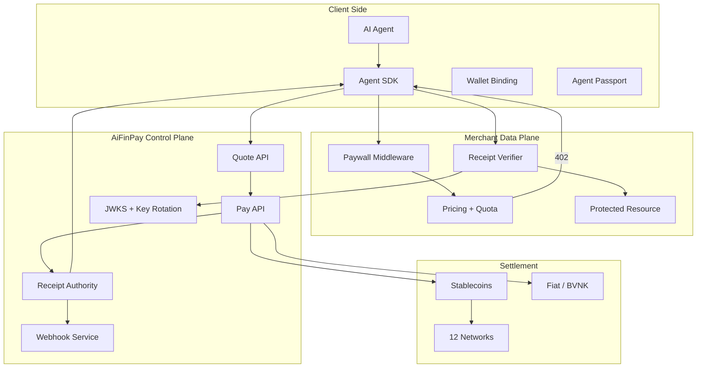
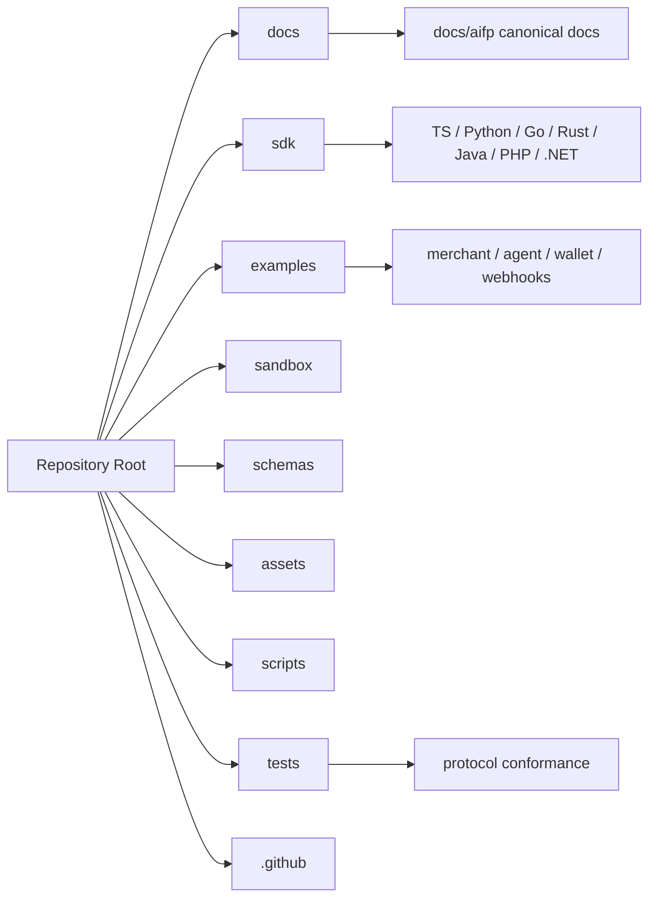

# Architecture Overview

AiFinPay Paywall Protocol separates payment orchestration from request authorization. The control plane signs receipts; the merchant data plane verifies them locally.

## System Model

## Trust Boundaries

| Boundary | Trust Assumption | Control |
|---|---|---|
| Agent to merchant | Network is untrusted | TLS and signed receipts |
| Agent to control plane | Agent authenticates with API key | Authorization and budgets |
| Control plane to merchant | Receipt is bearer proof | Ed25519 signature and audience binding |
| Merchant data plane | Must work during degraded mode | Local verification and cached JWKS |
| Settlement layer | Chain or fiat settlement may be async | Receipt issuance policy and webhooks |

## Data Plane

The merchant data plane is intentionally small:

1. Identify agent and quota state.
2. Return a machine-readable `402` challenge when payment is required.
3. Verify receipt signature and claims locally.
4. Serve or reject the protected resource.

## Control Plane

The AiFinPay control plane owns:

- Quotes.
- Payments.
- Receipt issuance.
- Ledger records.
- Settlement adapters.
- Webhooks.
- JWKS and key rotation.
- Policy, risk, and Agent Passport services.

## Repository Architecture

The canonical repository architecture is maintained in [`docs/aifp/15-Repository-Architecture.md`](aifp/15-Repository-Architecture.md).
