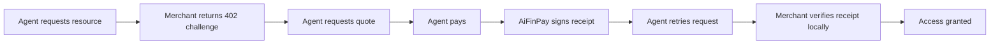

# AiFinPay Documentation Portal

Welcome to the AiFinPay Paywall Protocol documentation portal.

AIFP is an HTTP-native payment protocol that lets autonomous AI agents pay for APIs, content, and data through a `402 Payment Required` flow.

## Start Here

| Role | Recommended Path |
|---|---|
| New developer | [Quick Start](quickstart.md) |
| Merchant engineer | [Merchant Guide](merchant.md) → [Integration Guide](aifp/02-Merchant-Integration-Guide.md) |
| Agent builder | [Agent Guide](agent.md) → [Agent SDK Spec](aifp/03-AI-Agent-SDK-Specification.md) |
| Wallet/platform engineer | [Wallet Guide](wallet.md) → [Security Spec](aifp/04-Security-and-Cryptography-Specification.md) |
| Protocol implementer | [AIFP-1 RFC](aifp/01-AIFP-1-RFC-Payment-Protocol-Specification.md) |
| API tooling | [OpenAPI 3.1](aifp/08-OpenAPI-3.1-Specification.yaml) and [JSON Schemas](aifp/10-JSON-Schemas.md) |
| Maintainer | [Repository Architecture](aifp/15-Repository-Architecture.md) and [AIP Process](aifp/06-AIP-Improvement-Proposal-Process.md) |

## Documentation Sections

| Section | Description |
|---|---|
| [Architecture](architecture.md) | System model, trust boundaries, data plane, control plane |
| [Quick Start](quickstart.md) | First merchant, agent, wallet, and sandbox flows |
| [Navigation](navigation.md) | Complete documentation map |
| [AIFP Docs](aifp/README.md) | Canonical documentation package |
| [SDKs](../sdk/README.md) | SDK package strategy and language matrix |
| [Examples](../examples/README.md) | Runnable examples and recipes |
| [Sandbox](../sandbox/README.md) | Development and testing environment |
| [Schemas](../schemas/README.md) | Validation and machine-readable contracts |

## Protocol In One Flow

## Canonical Documents

The canonical documentation package lives in [`docs/aifp/`](aifp/README.md). These documents govern protocol behavior and should be treated as source of truth.
