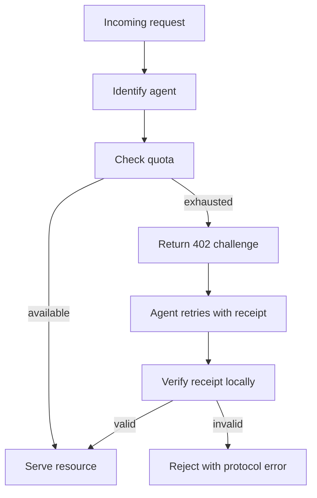

# Merchant Guide

Merchants integrate AIFP to monetize APIs, content, and data consumed by AI agents.

## Merchant Responsibilities

| Responsibility | Description |
|---|---|
| Price resources | Assign pricing_tier tier and free quota |
| Return challenges | Emit `402 Payment Required` with machine-readable payload |
| Verify receipts | Check signature, issuer, audience, resource, amount, expiry, nonce |
| Serve content | Grant access after successful local verification |
| Emit events | Use webhooks and logs for settlement and audit |

## Merchant Flow

## Canonical References

- [Merchant Integration Guide](aifp/02-Merchant-Integration-Guide.md)
- [AIFP-1 RFC](aifp/01-AIFP-1-RFC-Payment-Protocol-Specification.md)
- [Security & Cryptography Specification](aifp/04-Security-and-Cryptography-Specification.md)
- [OpenAPI 3.1](aifp/08-OpenAPI-3.1-Specification.yaml)

