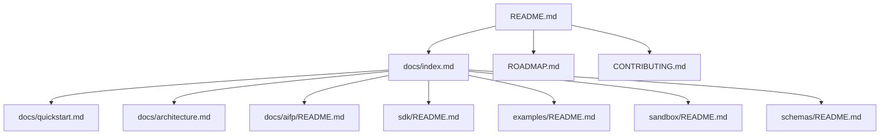

# Documentation Navigation

Every important document should be reachable within two clicks from the repository README.

## Primary Paths

## Canonical AIFP Package

| # | Document | Purpose |
|---|---|---|
| 01 | `01-AIFP-1-RFC-Payment-Protocol-Specification.md` | Normative protocol specification |
| 02 | `02-Merchant-Integration-Guide.md` | Server-side merchant integration |
| 03 | `03-AI-Agent-SDK-Specification.md` | Agent SDK behavior |
| 04 | `04-Security-and-Cryptography-Specification.md` | Threat model and cryptography |
| 05 | `05-Whitepaper.md` | Vision, market, and model |
| 06 | `06-AIP-Improvement-Proposal-Process.md` | Governance process |
| 07 | `07-Quick-Start-Guide.md` | Developer onboarding |
| 08 | `08-OpenAPI-3.1-Specification.yaml` | API source of truth |
| 09 | `09-Postman-Collection.json` | API testing collection |
| 10 | `10-JSON-Schemas.md` | JSON Schema definitions |
| 11 | `11-SDK-Reference.md` | Language SDK reference |
| 12 | `12-Developer-Portal-Structure.md` | Portal information architecture |
| 13 | `13-Branding-Guidelines.md` | Brand and writing style |
| 14 | `14-Ecosystem-and-Governance.md` | Ecosystem strategy |
| 15 | `15-Repository-Architecture.md` | Repository and org architecture |

## Maintenance Rule

If a page introduces a new concept, link it to its canonical document. If a canonical document changes, update all affected overview pages and examples.
