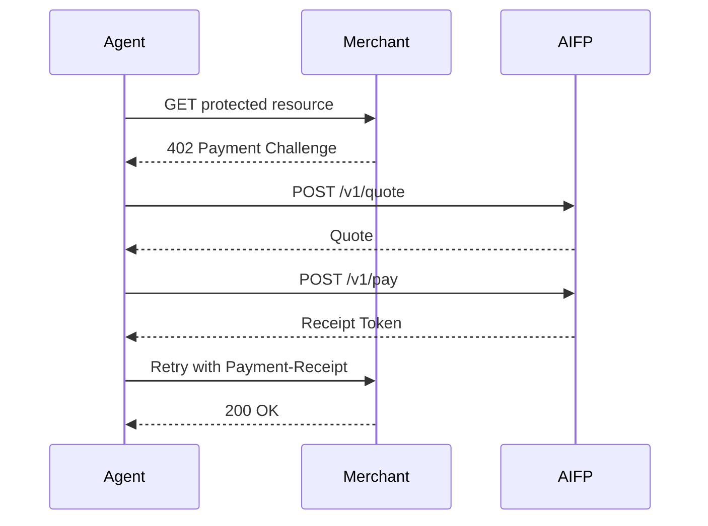

# Quick Start

This page gives the shortest path through AiFinPay Paywall Protocol for merchants, agents, wallets, and API testers.

For the canonical guide, see [`docs/aifp/07-Quick-Start-Guide.md`](aifp/07-Quick-Start-Guide.md).

## Pricing Snapshot

| Tier | Starts From | Typical Action |
|---|---:|---|
| Standard | `$0.00001` | Simple read, single record, lightweight API request |
| Complex | `$0.00006` | Search, aggregation, multi-source queries, higher compute |
| Premium | `$0.00010` | AI inference, GPU workloads, deep analytics, premium data |

AiFinPay charges a **1% protocol fee** on every successful transaction. The remaining **99%** is settled to the merchant, excluding applicable network or settlement costs.

## Merchant

```bash
npm install @aifinpay/merchant
```

```ts
import { aifpPaywall } from "@aifinpay/merchant";

app.use(aifpPaywall({
  merchantId: "mrch_...",
  pricing: {
    "/api/data": { tier: "standard" }
  }
}));
```

## Agent

```bash
npm install @aifinpay/agent
```

```ts
import { AIFPAgent } from "@aifinpay/agent";

const agent = new AIFPAgent({
  apiKey: process.env.AIFP_AGENT_KEY,
  walletId: "wlt_...",
  budget: { dailyUsd: 5 }
});

const response = await agent.fetch("https://merchant.example.com/api/data");
```

## API Flow



## cURL Quote

```bash
curl https://api.aifinpay.io/v1/quote \
  -H "Authorization: Bearer $AIFP_AGENT_KEY" \
  -H "Content-Type: application/json" \
  -d '{"merchant_id":"mrch_9f3a1c2b","resource":"/api/data","pricing_tier":"standard"}'
```

## Next Steps

- Read [AIFP-1](aifp/01-AIFP-1-RFC-Payment-Protocol-Specification.md).
- Explore [examples](../examples/README.md).
- Validate API requests with [OpenAPI 3.1](aifp/08-OpenAPI-3.1-Specification.yaml).
- Review [Security](../SECURITY.md) before production use.
